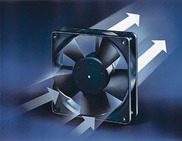
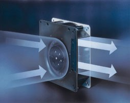

[toc]

# 第四章    无霜冰箱的空气循环系统设计

&emsp;&emsp;无霜冰箱和直冷冰箱最大的差异就是无霜冰箱在箱内内置一套空气循环系统，该系统由风机、箱内风道、发泡层内风道、蒸发器等部件构成，之所以把蒸发器放在空气循环系统中，因为其空气侧阻力特性和换热特性对空气循环系统的性能和可靠性也有重要影响。这样一套空气循环系统在冰箱中起到的作用有：
* 循环流经蒸发器的热空气被冷却后，输送至冰箱箱内存贮空间进行2次制冷，热空气再由回风风道回到蒸发器完成循环。
* 带走箱内湿空气，便于在化霜时排出。
* 通过风道设计和风门的动作实现合理的制冷量分配。
  
## 4.0 介绍 
&emsp;&emsp;在进行无霜冰箱的系统设计时，空气循环系统设计是归类在结构设计当中的，但其性能却是间接地从整机性能试验中体现出来的，没有直接的可测量的设计指标，而且涉及多学科的技术耦合，这往往成为整机系统设计的重点和难点。在进行一个无霜冰箱的空气循环系统（风道系统）设计时，最主要的问题有如下几点：
* 设计空气循环有没有简单、清晰、可操作性强的基本基本设计原则，可以在不需要很多交叉知识背景的前提下，做出良好的结构设计？
* 没有办法直接测量，怎样搞清楚风道设计的到底是好还是坏？通过什么办法可以间接进行评价？
* 如何根据性能要求调整风道的结构设计，使之与系统设计要求相匹配？
* 怎样保证风道系统的可靠性？
&emsp;&emsp;本章首先从基本原理和概念出发，给出冰箱空气循环系统的描述方法和物理图像，然后介绍设计基本原则和匹配方法，然后总结评估设计质量的方法。

## 4.1 基本概念和原理
&emsp;&emsp;风机是驱动空气流动，提供连续空气流量（风量）的核心器件，同时风机也可以被视为一个透平机械（turbomachine），流经风机的空气被略微压缩，但其压缩比$R_{com}$（compression ratio)一般小于1.07。
$$ R_{com}=\frac{p_{dis}}{p_{suc}} \qquad\qquad \qquad\qquad(1) $$

### 4.2.1 描述风机性能的相关物理概念

&emsp;&emsp;了解风机的性能，首先需要了解风机的全压、动压和静压等概念：
#### &emsp;&emsp;全压（total Pressure）：
&emsp;&emsp;风机出口气流的全压与入口的全压之差：表征了单位时间，单位体积流量从风机获得的能量的多少。
$$ P_{tf}=P_{so}+ \frac{\rho v_o^2}{2} -P_{si}- \frac{\rho v_i^2}{2}\qquad (2)$$ 
#### &emsp;&emsp;风机的动压：
将风机出口的气流动压定义为风机的动压：
$$ p_{df} =p_{do}= \frac{\rho v_o^2}{2} \qquad (3)$$
#### 风机的静压：
风机的全压减去风机的动压：$$p_{sf}=p_{tf}-p_{df}=P_{so} -P_{si}- \frac{\rho v_i^2}{2} \qquad (4)$$
#### 风机的容量（流量）：
风机的容量，指风机入口的体积流量，即：
$$ \dot{V_f} = v_{i}\cdot A_{i} \qquad (5)$$
#### 风机的输入功率、效率：
风机的有效输入功率：
$$ P_f = p_{tf}\cdot \dot{V}_f \qquad (6)$$
风机的效率：
$$ \eta_{tf} = P_f/P_{input}= \frac{ p_{tf}\cdot \dot{V}_f}{P_{input}} \qquad (7)$$
有时候，会单独以转化成静压部分的能量来定义风机的效率:
$$ \eta_{sf} = P_{sf}/P_{input}= \frac{ p_{sf}\cdot \dot{V}_f}{P_{input}}\qquad (8)$$
#### 风机的性能曲线：
&emsp;&emsp;风机的性能特性可以用几组相互关联的参数来表示，当$\dot{V}=0$时，表示入口封闭，此时风机轴功率全部为无效功，$\eta_t$、$\eta_s$全部为零；当风机敞口通向大气时，所有能量均转换为风机的动压，静压为零，此时$\eta_s=0$，但风机的电能仍有一部分转换为风机的动压，所以$\eta_t \ne 0$。在设计系统和进行风机选型时，要尽量选择让风机工作在效率的峰值区域。

 图1 风机性能曲线 

### 4.2.2 常用风机的类型
&emsp;&emsp;常用风机种类有两种，轴流式（axial）和离心式（centrifugal）两种：轴流式风机的进风方向和出风方向平行；而离心式风机的出风方向和进风方向比偏转了$90^\circ$， 轴流风机常用于要求通风量高，流动阻力小，对静压要求不高的场合，比如冰箱压缩机仓的冷凝换热系统和小型冰箱的箱内空气循环系统中；离心风机由于其静压高的特点，适用于循环阻力大的换热系统，在各类无霜冰箱的箱内空气循环系统中都有应用。

图2 轴流与离心风机

#### 4.2.2.1 离心风机的基本结构 
&emsp;&emsp;一个完整的离心风机由电机、叶片和外壳（蜗壳）组成。而我们通常采购使用的离心风机不包含外壳如图

图3 离心风机结构

&emsp;&emsp;

图4 冰箱用离心风机结构

&emsp;&emsp;离心风机通过叶片旋转产生的离心力将空气“甩”出而产生气流，离心风机产生的气流的静压比轴流风机要大，离心风机通常需要在外壳的配合下，将离开叶片的气流的流速降低，从而使动压转换成静压，以适应高流阻的应用环境,见图5。

图5 离心风机出口静压分布
&emsp;&emsp;离心风机产生的气流离开叶片时，既有径向速度又有切向速度，所以离心风机的叶片结构设计决定了离心风机的性能表现。

图5 叶片设计与性能曲线

上图中是前向叶片和后向叶片的结构和性能曲线，前向叶片的末端向旋转方向弯曲，而后向叶片正好相反。前向叶片末端气流的流速较大，后向叶片流速较低。
在同等直径条件下：前向叶片的$P - \dot{Q}$曲线较为平坦,随着风量增加，其功率迅速升高，并且功率增加幅度也随风量增加而增加（$\frac{d^2 P}{d\dot{Q}^2}>0)$，容易产生过载现象;而后向叶片随着通风量增加，其功率曲线存在一个极值点，经过此点后，随着风量增加，需要输入的功率反而下降，不会产生过载现象。
&emsp;&emsp;通常在冰箱系统中，在同等系统阻力条件下，一般都选择后向叶片的离心风机，以获得最高的风量和最低的输入功率。
&emsp;&emsp;离心风机需要配套的外壳将出风导向机器的出风流道，同时降低出口流速，在降低流动阻力的同时提高出风的静压，这对于提升系统的性能和效率非常重要，在冰箱系统设计中，离心风机外壳（蜗壳）设计的优劣对于整机的制冷性能和噪音表现影响很大。

#### 系统阻力
&emsp;&emsp;当气流离开风扇开始在风道内流动，则会因摩擦损失部分能量，从风道入口到风道出口，气流的静压呈逐渐降低的趋势。总体而言，摩擦造成的静压损失和风道内的流速的平方呈正比，在管道截面不变的情况下，系统阻力曲线呈抛物线的形状。

$$ \Delta p  = a \frac{v^2}{D_h}$$

#### 风机定律
&emsp;&emsp;几何结构类似的风机，其性能可以通过风机定律很方便地获得，假设入口空气状态相同,则风机定律可以总结如下：
* 当风机直径$D_f$不变时：流量跟转速的一次方成正比；压力跟转速的立方成正比；功率和转速的立方成正比
  *  $ \dot{V} \propto N_f$ 
  * $ p_f \propto N_f^2$
  * $ P_f \propto N_f^3$
* 当风机转速$N_f$不变时：流量跟风机直径的三次方成正比；压力跟风机直径的平方成正比；输入功率跟风机直径的5次方成正比
  *  $ \dot{V} \propto D_f^3$ 
  * $ p_f \propto D_f^2$
  * $ P_f \propto D_f^5$    

&emsp;&emsp;在进行设计选型时，可以根据已有产品的风机参数，按照风机定律，推算新产品所需风机的参数。

## 4.2 空气循环系统的性能和匹配

### 4.2.1 空气循环对制冷系统的影响

   *  对制冷系统工况的影响： 与蒸发器内流过的低温制冷剂换热，空气循环的流速越大，换热能力就越强，体现在蒸发器的空气侧传热热阻减小(即$UA_{evap}\uparrow$），流经蒸发器前后的气流温差变小（$[T_{a-in}-T_{a-out}]\downarrow$),制冷剂与空气的传热温差变小（$\Delta T_m \downarrow$），这对提高制冷系统的性能是非常重要的。
  $$ Q_e = \dot{V}_a \rho_a C_{p.a}(T_{a-in}-T_{a-out})=UA_{evap}\Delta T_m$$
  $$ \Delta T_m = \frac{(T_{in}-T_{evap})-(T_{out}-T_{evap})}{ln(\frac{T_{in}-T_{evap}}{T_{out}-T_{evap}})}
  $$
* 系统风量对整机耗电量的影响
  * 系统风量增加，制冷系统的工况一般会得到优化，系统的COP提升，压缩机消耗电能会降低。
  * 系统的循环风量提升，如果没有造成风机输入功率明显增加（如减小系统阻力，使系统工作在风机的效率最高点），则风循环系统+制冷系统的总电能消耗会明显降低。
  * 如果系统的循环风量提升是依靠风机转速提高来实现的，则风机消耗的电能有可能会增加，与制冷系统消耗电能降低相抵消。

### 4.2.2 空气循环系统的特性曲线：

&emsp;&emsp;优化空气循环系统的三条路：

1、 使用更高性能的风机，获取更高的风量
2、 优化系统阻抗曲线，获得更大的系统风量
3、 在总风量满足系统需要的情况下，降低风机转速，获得更好的噪音表现

在进行冰箱空气循环系统设计时，最重要的工作就是风机的选型、风道的低阻抗设计和风机转速的匹配，做好这三点就能实现整机性能和噪音的优化匹配。

### 4.2.3 风循环系统的可靠性

## 4.3 空气循环系统的性能评价

## 4.4 空气循环系统的设计与匹配方法

## 4.5 可靠性设计

# 
第四章    箱内风循环系统设计 

&emsp;&emsp;无霜冰箱和直冷冰箱最大的差异就是无霜冰箱在箱内有一套空气循环系统，该系统由风机、出风风道、回风风道等结构件和风门、传感器等控制部件构成，俗称为风循环系统或风道系统。不同于直冷冰箱直接通过换热器将制冷量直接传递到箱内各间室，风冷冰箱的制冷量的输送、分配和调控都是依靠箱内空气循环系统进行的，风机产生的循环风充当了“二次制冷剂”的作用，即蒸发器把制冷量传递给流经蒸发器管外侧的箱内循环气流，风道系统再调配风量进入各个间室满足其制冷需求。
&emsp;&emsp;从总体看，风循环系统对于风冷（无霜）冰箱的性能、质量和成本都有重要影响，体现在如下几个方面：
  * 系统循环风量和风压会影响制冷系统的工况，从而影响制冷系统产生的制冷量大小和电能消耗量的多少，而这正是家用冰箱的重点性能指标。
  * 制冷量分配是风道系统的重要功能，如果制冷量的分配无法满足各个间室的动态需求，也会造成制冷量的浪费和额外的电能消耗，对冰箱的性能指标不利。
  * 制冷量和耗电量两个指标直接关系到制冷系统的选型和箱体结构设计，而这两项设计对总成本的影响非常大，有可能直接决定产品开发的成败。
  * 风循环系统会把箱内的水汽携带至蒸发器的冷表面产生结霜，随着霜层的累积，风循环通道变窄甚至堵死，其制冷量输送和分配功能也会逐渐丧失，导致冰箱不能正常工作。虽然有化霜系统定时除霜，但如果风道系统设计不当，冰箱在正常化霜周期内就有可能出现无法正常工作的情况，产品如果上市前未发现，则有可能招致严重的售后投诉。
  
&emsp;&emsp;在进行无霜冰箱的系统设计时，空气循环系统设计是归类在结构设计当中的，但由于缺乏直接测量风循环系统性能的方法和设备，结构设计人员无法直接进行计算和测量，虽然现在已经有CAE等手段进行建模分析，但其准确性和实用性仍需进一步提高，目前冰箱产品的风循环系统设计的性能评价仍然是依靠整机性能试验进行间接评价，这个流程是这样的：
 >   “设计$\rightarrow $制作样机$\rightarrow $性能测试 $\rightarrow $ 分析整改$\rightarrow $制作样机$\rightarrow $性能测试$\cdots \cdots$”

&emsp;&emsp;如果结构设计师不了解风循环系统的设计原理和方法，完全按照个人理解乱画或者对着竞品照猫画虎，制冷设计师又不懂得风循环系统对制冷系统性能的影响，无法根据性能试验数据评估风循环系统性能并给出优化建议，这种情况就会对产品开发造成灾难性的影响。
&emsp;&emsp;对多年的无霜冰箱开发经验进行总结，在进行无霜冰箱的空气循环系统（设计时，设计人员最重要的工作是回答和解决以下4个难题：
* 在不需要掌握复杂的系统分析工具的前提下，怎样给出一个科学合理的基础设计，避免后续伤筋动骨改模具？
* 怎样评价风道设计的到底是好还是坏？通过什么办法可以间接进行评价？
* 如何根据性能要求调整风道的结构设计，使之与系统设计要求相匹配？
* 怎样保证风道系统的可靠性？

&emsp;&emsp;本章的主要内容将针对以上4个问题进行展开，首先介绍风循环系统相关的流体机械的原理和概念，然后介绍风循环系统在冰箱系统中的性能评价方法，然后介绍风道系统的基本设计和选型方法，最后对系统可靠性设计进行讨论。希望读者通过阅读本章内容，能够掌握风循环系统设计的基本原理和方法，能够根据产品的设计需求和实验数据进行风道系统的设计和优化，保证冰箱的性能和质量同时达到设计达标。

## 4.1 风机与风道系统的相关基本概念

