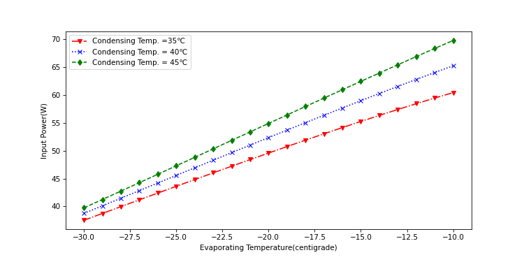
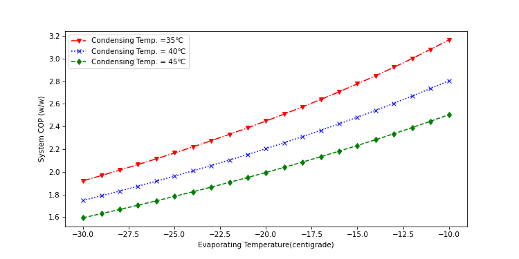

[toc]
## 一、制冷系统的热动力学基本原理

&emsp;&emsp;冰箱需要使用压缩机将电能转化为热能和机械能，驱动制冷剂在管路内循环流动形成$\bf“有回热的朗肯循环”$，将箱体内部的热量带走并排放至环境中，从而实现制冷功能，这是一个典型的非线性热力/机械动力系统，描述和计算系统的运动是非常复杂的，但基本的物理学定律，如质量守恒、动量守恒和能量守恒对于制冷系统仍然是严格适用的：

### 1.1 质量守恒
&emsp;&emsp;制冷系统依靠制冷剂的运动来实现能量的运输和传递，压缩机做功压缩制冷剂，其流量表达式为：
$$ \dot{m}_{ref} = \frac {\eta_vV_kN}{v_1}  $$
$$ \eta_v =\eta_1(P_{cond},P_{evap},N)$$ 
当系统运行稳定后，毛细管的质量流量与压缩机的排气质量流量相等,毛细管内流动一般为两相流动：
$$ \dot{m}_{comp} = \dot{m}_{capillary} $$

### 1.2 动量守恒(牛顿第二定律)
&emsp;&emsp;当制冷系统运行时，冷凝器侧（高压侧）与蒸发器侧（低压侧）存在压差，压差由压缩机的运动来维持：当压缩机吸入气体后，在气缸内被压缩后压力升高，排出后向毛细管入口流动，由于沿程阻力的影响，到达毛细管入口时，其压力会略有降低。一般在冰箱等小型制冷系统中，可近似按照排气压力与饱和冷凝压力相等来进行系统性能计算。
&emsp;&emsp;毛细管进出口之间的压差驱动制冷剂从冷凝器侧流向蒸发器侧，在毛细管内摩擦阻力作用下降压降温，到毛细管出口时，压力与蒸发压力相同，然后在蒸发器内流动时，受沿程阻力的影响，压力会降低，导致蒸发器出口温度低于蒸发器入口温度。一般情况下可近似认为吸气压力等同于饱和蒸发压力
&emsp;&emsp;当制冷剂从吸气管进入压缩机，依次通过消音器$\rightarrow$吸气腔$\rightarrow$吸气阀片$\rightarrow$气缸$\rightarrow$排气阀片$\rightarrow$排气腔$\rightarrow$内排管$\rightarrow$排气管,在吸入和排出时，会存在压力损失,这两项压力损失会造成压缩机的耗功增加，如图所示：

图1 单级压缩制冷系统实际热力循环图

### 1.3 能量守恒
&emsp;&emsp;冰箱制冷系统采用的是有回热的朗肯循环，制冷系统从箱内吸收的热量和压缩机消耗的电能，最终都以热量形式排放至环境中，具体来讲：存在以下几个热量的传递和转化的环节：
#### 1.3.1 压缩机能量的转化
&emsp;&emsp;压缩机获得的电能，最终一部分转化为有用功传递给制冷剂，另一部分转化为电机发热和摩擦热，传递给机壳并散发到环境中，另外从气缸排出的高温高压的制冷剂蒸汽也会在压缩机机壳内排放部分热量，最终也会传递给机壳并散发至环境中去。
&emsp;&emsp;压缩机的有效功：
$$ W_{is} = {\dot{m}_{ref}(h_{2s}-h_1)}$$
&emsp;&emsp;压缩机的输入功为：
$$ P_{el}=\frac {W_{is}} {\eta_{is}}=\frac {\dot{m}_{ref}(h_{2s}-h_1)}{\eta_{is}} $$
$$\eta_{is}= \eta_2(T_{cond},T_{evap},N)$$
&emsp;&emsp;无效功转化为机壳的得热量为：
$$\dot{m}_{ref}(h_{2s} - h_1)(\frac{1}{\eta_{is}}-1)] $$
&emsp;&emsp;压缩机内排气侧散热量为：
$$\dot{m}_{ref}(h_{2s} - h_2)$$
&emsp;&emsp;通过压缩机壳向环境排放的热量为：
$$Q_{comp} = UA_{comp}(T_2-T_{amb}) = \dot{m}_{ref}[(h_{2s} - h_1)(\frac{1}{\eta_{is}}-1)+(h_{2s}-h_2)] $$
注意上式中，定义压缩机排气与环境温度差值作为传热温差（参考EMBRACO研究论文的处理方式）。
#### 1.3.2 冷凝端散热
&emsp;&emsp;冷凝器排热量为: $ Q_{cond} = \dot{m}_{ref}(h_2 - h_3) ={UA}_{cond}(T_{cond}-T_{amb})$ ,此处在数学描述上做了简化，以饱和冷凝温度与环境温度的差值作为平均传热温差。
#### 1.3.3 毛细管回热
&emsp;&emsp;毛细管与回气管的回热量为：$ Q_{ihx}= \dot{m}_{ref}(h_3 - h_{4'})= \dot{m}_{ref}(h_1 - h_{5})  $  
#### 1.3.4 蒸发器吸热
&emsp;&emsp;蒸发器吸收的热量为：$ Q_{evap}=\dot{m}_{ref}(h_1 - h_{3}) ={UA}_{evap}(T_{air}-T_{evap})$
#### 1.3.5 箱体漏热
$$ Q_{cab} = \sum_{i=1}^n K_iA_i\delta T_i $$ 
$$\delta T = T_{out}-T_{in}$$
&emsp;&emsp;制冷系统的能量传递与转化关系示意见图2，制冷剂循环状态可在压焓图上用图3进行标示：

图3 制冷系统的能量转化示意图

图4 制冷剂循环在压焓图上的表示

1：压缩机吸气入口
2s：压缩机排气出口
2：压缩机排气管出口
3：过滤器（毛细管入口）
4':蒸发器入口（毛细管出口）
4':绝热节流过程毛细管出口
5：储液器入口（蒸发器出口）

## 二、 制冷剂在系统中的运动和循环
&emsp;&emsp;蒸汽压缩式制冷循环（朗肯循环）利用制冷剂的流动和状态变化，实现能量的转化和运输。其优点在于气体-液体的相变转化过程吸收/释放的热量要远大于显热的吸收和释放，从而实现了系统的小型化。理解制冷系统运行过程中制冷剂的运动和变化规律，是理解制冷系统设计原理的基础。
### 2.1 拉低温过程制冷剂的迁移
&emsp;&emsp;当冰箱处于未启动状态，箱体内外温度、制冷系统高低压力平衡的状态下，制冷剂除部分溶解在压缩机润滑油内，其它全部以气态存在于系统中。
&emsp;&emsp;从压缩机启动到运行约1min的时间内，瞬间蒸发器内气态制冷剂被抽进压缩机，此时蒸发器侧制冷剂的压力/温度都会急剧下降，由于蒸发器内没有液态制冷剂，压力下降会造成压缩机吸气流量迅速衰减；此时冷凝器侧因为高温制冷剂排入，压力迅速升高，由于毛细管的阻力作用，大量制冷剂滞留在冷凝器内，在毛细管两侧很快形成压差，驱动制冷剂通过毛细管流向蒸发器侧，刚开机的1min之内是没有液态制冷剂流过毛细管的，有液态制冷剂流过大约需要3min以后，在过滤器内会形成稳定的液位。

 

图5 过滤器内液态制冷剂的形成（左-未开机；右-开机3min以后）

&emsp;&emsp;此后由于蒸发器开始和箱内热空气换热，流经蒸发器的制冷剂的温度和压力开始回升，压缩机吸气流量开始增大，导致冷凝器侧压力继续上升，冷凝器侧过冷度会呈现增大的趋势；大约20～30min后，系统的冷凝压力会达到拉低温时的峰值，此时就是系统的最大负荷点。

图6 某冰箱43度拉低温过程高低压力曲线

&emsp;&emsp; 当系统过了最大负荷点后，冷凝器侧/蒸发器侧压力均下降，此后箱内空气的温度会主导系统工况的变化；冷凝器的过冷度开始变小，制冷剂开始由冷凝器侧迁移至蒸发器侧，可以观察到蒸发器的过热度逐渐减小直至消失。毛细管与压缩机的质量流量趋于平衡。

&emsp;&emsp;每当系统出现压缩机流量突然增大的情况，就会出现制冷剂从蒸发器迁移，冷凝器过冷度升高的情况，同时可能伴随着蒸发器短暂过热。

图7 某冰箱43度拉低温过程工况温度曲线

### 2.2 开停机过程的制冷剂迁移
&emsp;&emsp;当冰箱运行稳定后，冷凝器过冷度降至稳定值，液态制冷剂从冷凝器中迁移至蒸发器中，蒸发器和储液器的液态制冷剂量逐渐增加直至达到稳定。

图8 停机前蒸发器及储液器X光照片

&emsp;&emsp;当压缩机停机后，压缩机流量瞬间停止,但此时毛细管两侧压差仍然存在，所以仍然会有制冷剂从冷凝器向蒸发器内迁移，从蒸发器入口温度曲线可以观察到；此时过滤器内剩余的制冷剂会随着压力降低而汽化，造成过滤器的温度在压缩机停机后突然降低至环温以下，甚至可能产生凝露或结冰现象。一般情况下，在停机段，会有大量的制冷剂滞留在蒸发器内，储液器内的制冷剂会通过回流孔倒灌回蒸发器内。
&emsp;&emsp;当压缩机再次开机，则会将液态制冷剂赶向压缩机吸气侧，储液器会出现一个充液的过程，储液器内液位升高，如果此时漫过内插管，则会有液滴被吸入压缩机，有潜在的液击风险。

图9 开机过程蒸发器及储液器X光照片

### 2.3 保压原理
&emsp;&emsp;如前所述，当制冷系统停机后，由于毛细管进出口压差仍然存在，冷凝器内制冷剂继续向蒸发器内迁移，同时由于冷凝压力下降，原来存储在冷凝器末端的液态重新汽化；毛细管两侧压力平衡后，随着停机时间的延长，冷凝器内压力和蒸发器内压力都升高，下次开机则会有更高的吸气流量瞬时排向压缩机，导致压缩机功率远高于稳定状态；同时由于停机时间较长，冷凝器内制冷剂量很少，需要较长的压缩机运行时间才能被“激活”，产生液态制冷剂供给蒸发器实现制冷。也就是说：刚开机的若干分钟，压缩机的能量会被用来将制冷剂重新搬运至冷凝器侧，而这一过程不会产生显著的制冷量，降低了系统COP。
&emsp;&emsp;如果在冷凝器和毛细管之间加一个阀门，在压缩机停机后切断制冷剂流向蒸发器，则可以在相当长一段时间内保持冷凝器侧压力高于蒸发器侧，蒸发器侧压力上升速率变慢，当下次开机时，不会产生大吸气流量冲击导致压缩机功率升高的现象，同时由于冷凝器内仍然留存了大量制冷剂，产生有效制冷量的时间提前，压缩机提供的电能得到有效利用。
&emsp;&emsp;保压阀在压缩机停机时间较长的情况下能够产生可观的节能效果；在变频冰箱系统中应用时，32度由于停机时间短，节能效果不明显，但16度环温时可以节约1W左右的功耗。

### 2.4 系统制冷剂灌注量
&emsp;&emsp;由于冰箱是一种全封闭制冷系统，制冷剂充注量不能随意调整，所以制冷剂充注量的匹配是非常重要的一环，既要保证制冷系统在各种状态下，蒸发器维持最低的过热度，同时也必须保证不会有液态制冷剂通过回气管线进入压缩机，影响压缩机寿命。
&emsp;&emsp;由于制冷剂有“喜冷怕热”的特性，所以制冷剂在系统中的分布是不均匀的，当环境温度低，热负荷小时，制冷剂喜欢呆在冷凝器里，相对应蒸发器内就可能产生缺液状态；而当环境温度高，热负荷较大时，冷凝器过冷度小，液态制冷剂主要分布在蒸发器里，需要注意储液器的容积是否足够。通常的规律是，环境温度高，转速高的状态下，蒸发器过热度小；而当环境温度低时，蒸发器过热度升高，处于缺液状态。这种现象在变频产品上体现最为明显。
&emsp;&emsp;如果制冷系统的冷凝器管路较长，内容积较大，在环境温度低并且以最低转速运转的情况下，由于冷凝器内过冷度较高，截流了大量制冷剂，则极有可能会造成蒸发器严重缺液，产生系统制冷量低，压缩机不停机的现象。

### 2.5 充注量的大小和匹配方法
&emsp;&emsp;一般说来，影响制冷系统充注量的因素为蒸发器和储液器的内容积，受冷凝器大小，压缩机排量影响较小；特别是当蒸发器管路设计长度和水力直径发生变化时，需要重新匹配灌注量。
&emsp;&emsp;匹配冰箱的灌注量一般都采用实验确认的方式，采用拉低温或者近稳态开停运行监测蒸发器过热度、回气温度、回热系数的方法综合确认：
1、蒸发器过热度最小化,高环温运行时过冷度应为零，低环温时应最小化。
2、回气温度在环温附近，露点温度以上
3、回热系数$\epsilon_{ihx}$>0.85
$$ \epsilon_{ihx}= \frac{T_1-T_5}{T_{4'}-T_3} $$

## 三、 制冷系统匹配的流程
&emsp;&emsp;冰箱新品制冷系统匹配需要经过复杂的理论计算和实验确认和优化工作才能完成，按照原EMBRACO工程师的观点，需要经过下图所列出的流程：
>1、热负荷计算
>2、定义系统工况
>3、压缩机选型
>4、毛细管选型
>5、换热器选型
>6、定灌注量
>7、性能测试
>8、控制逻辑匹配
>9、系统优化迭代 

&emsp;&emsp;由于冰箱制冷系统是一个复杂的非线性小型制冷系统，想要精确仿真其热力和动力性能是非常困难的，做样机和测试工作不可避免，如何根据理论优化设计参数，减少迭代的实验环节，提高匹配效率，是本章的核心主题。

图10 制冷系统匹配流程

### 3.1 箱体热负荷的变化规律
&emsp;&emsp;冰箱的热负荷是在做制冷系统匹配时最重要的控制环节：箱体设计热负荷偏高，则压缩机选型时排量要增大，COP要增加；蒸发器、冷凝器的设计容量全部要增加，产生的后果是系统匹配难度和设计成本的全面上升. 
&emsp;&emsp;需要特别注意的是，冰箱系统的热负荷随着环温增加是非线性的，其一阶导数是逐渐增加的。即环温越高，热负荷增加的就越快。热负荷的计算可以用下式：
$$ Q_{cab} = \sum_{i=1}^n K_iA_i\delta T_i $$ 
$$\delta T = T_{out}-T_{in}$$
在上述公式中，环温升高，箱体外表面$T_{out}$温度相应升高，内部$T_{in}$维持不变，则传热温差与环温上升是线性关系，但传热K值也会随环温上升而增加，从而使得总漏热量迅速增加。

图11 发泡层热导率随环温变化规律

&emsp;&emsp;上图是某配方发泡料的导热系数随环境温度增加的数据，我们使用的发泡料比上图增加的更快。下图是根据实验数据和压缩机性能曲线反推出的冰箱箱体热阻变化曲线，扣除压缩机流量的误差，真实值的曲线可能比下图稍微平坦一些。

图12 反推箱体热阻随环温变化曲线

### 3.2 系统工况对性能的影响

#### 3.2.1 系统工况
&emsp;&emsp;系统工况指系统运行至近稳态时，其各部件内制冷剂的状态参数（图4中1～5点制冷剂的温度、压力、干度等），一般情况下，我们在进行型式试验时，仅能在管道件和压缩机的进出口布置热电偶测量温度，但通过测量冷凝器和蒸发器的饱和段温度，我们可以间接求出饱和冷凝/蒸发压力，而制冷剂的状态参数（温度、压力、干度、比熵、比焓、比容）中，只要知道两个参数，就能确定制冷剂唯一的状态，所以在忽略冷凝器和蒸发器内的压降的情况下，只需要恰当地布置热电偶测量温度，我们就能计算出系统制冷剂所处的工况。
&emsp;&emsp;一般情况下，用温度参数来标识系统工况就够了，于是就有用冷凝温度、蒸发温度、过冷温度、吸气温度四个参数标记一个特定的制冷循环，大家看压缩机产品目录上都会标识此压缩机的性能是在ASHRAE或者CECOMAF工况下测量得到的，会忽悠的甚至自创一个冰箱工况，然后标识冰箱工况的压缩机性能数据。

图13 常用压缩机测试工况 

&emsp;&emsp;在冰箱上，在换热器和压缩机配置合理的前提下，冷凝温度一般比环温高冷凝温度一般比环境温度高5~10度，蒸发温度比冷冻室空气温度低5~10度，过冷温度一般比冷凝温度低1~3度，回气温度比环温低0~3度。所以冰箱的系统工况和压缩机的测试工况有很大差别，换热器和压缩机选型的差别会造成不同产品的系统工况有很大差别，所以很难定义出有普遍适用性的所谓“冰箱工况”。

&emsp;&emsp;冰箱实际运行工况决定了该工况下朗肯循环的性能，也决定了压缩机的实际吸排气性能和压缩机的效率，二者互相影响最终决定了实际冰箱系统的性能,如耗电量、储藏温度、冷冻能力等关键指标。

#### 3.2.2 基于能量守恒的冰箱系统稳态热力模型
&emsp;&emsp;要用文字描述清楚冰箱的系统工况的特点及其对冰箱系统性能的影响是比较困难的，但用一个简单的数学模型就可以把冰箱的稳态工况性能描述清楚，事实上，用这个模型求解冰箱的稳态性能也是完备的。

流经压缩机的制冷剂质量流量：

$$ \dot{m}_{ref} = \frac {\eta_vV_kN}{v_1}\centerdot \centerdot \centerdot(1)  $$
压缩机消耗的电功率：
$$ P_{electric}=\frac{w_{is}}{\eta_{is}}= \frac {\dot{m}_{ref}(h_{2s}-h_1)}{\eta_{is}}\centerdot \centerdot \centerdot(2)$$
压缩机壳体的发热量：
$$ Q_{comp} = UA_{comp}(T_2-T_{amb}) = \dot{m}_{ref}[(h_{2s} - h_1)(\frac{1}{\eta_{is}}-1)+(h_{2s}-h_2)] \centerdot \centerdot \centerdot(3)$$
压缩机的吸气效率和等熵效率从压缩机的性能曲线获得：
$$ \eta_v =\eta_1(P_{cond},P_{evap},N)\centerdot \centerdot \centerdot(4)$$ 
$$\eta_{is}= \eta_2(T_{cond},T_{evap},N)\centerdot \centerdot \centerdot(5)$$

冷凝器散热量：
$$ Q_{condenser} = {UA}_{condenser}(T_cond-T_{amb})= \dot{m}_{ref}(h_{2}-h_3)\centerdot \centerdot \centerdot(6) $$
蒸发器散热量：
$$ Q_{evap} = UA_{evap}(T_{freezer}-T_{evap})= \dot{m}_{ref}(h_{1}-h_3)\centerdot \centerdot \centerdot(7) $$
毛细管-回气管换热器：
$$ \epsilon_{ihx}= \frac {T_1 - T_5}{T_3-T_{4'}}\centerdot \centerdot \centerdot (8)$$
压缩机运行率：
$$ r_t = \frac {Q_{cab}}{Q_{evap}}\centerdot \centerdot \centerdot (9) $$
制冷系统COP：
$$ COP_{sys} =COP_{cycle}\centerdot\eta_{is}= \frac{h_1-h_3}{h_{2s}-h_1} \centerdot \eta_{is} \centerdot \centerdot \centerdot(10) $$

#### 3.2.3 工况对制冷系统的影响
&emsp;&emsp;根据公式（1），压缩机的吸气流量受容积效率$\eta_v$、吸气比容$v_1$（吸气密度$\rho_1=1/v_1$），压缩机转速$N$和扫气容积$V_k$的影响。首先假设吸气温度不变，蒸发温度从-30~-10度变化时，系统的吸气密度的变化如图,从图上可以看出，如果蒸发温度变化范围很大,则吸气流量会迅速增加。

图14 吸气密度随蒸发温度和吸气温度变化曲线 

&emsp;&emsp;根据公式（3），（6）和（7）可以看出，影响蒸发器和冷凝器的负荷的主要因素就是制冷剂的流量，而制冷剂的流量和蒸发/冷凝（温度/压力）关系密切。比如同样的200L箱体,做冷藏冷冻箱时只要侧板贴冷凝器就可以了，但做透明门冷藏箱就会出现冷凝温度严重偏高的现象。

&emsp;&emsp; 现在我们构建一个虚拟的冰箱循环，假设环境温度为32度，冷凝温度在35～45度范围内变化，蒸发温度在-30～-20度范围内变化，冷凝末端过冷度锁定为1.5K,回气温度按照公式（8）受毛细管-回气管换热器的性能影响，回热系数取0.85，则该理论冰箱循环的单位容积的制冷量和有效输入功为：

$$ q_v = (h_1-h_3)/v_1 $$ 
$$ w_v = (h_{2s}-h_1)/v_1 $$
$$ COP_{cycle}= q_v/w_v = \frac{(h_1-h_3)}{(h_{2s}-h_1)} $$

根据曲线可以看出系统的制冷量、有效输入功和COP都受到系统工况的影响：

图15 单位容积制冷量随蒸发、冷凝温度变化曲线 

图16 单位容积有效压缩功随蒸发、冷凝温度变化曲线 

图17 循环COP随蒸发、冷凝温度变化曲线 

&emsp;&emsp;现在我们开始考虑工况对压缩机的影响，目前使用的活塞连杆式压缩机，其容积效率曲线可以用以下公式进行拟合,由于变频压缩机转速对容积效率也有较大影响，所以
$$ \eta_v = a + b （ \frac {P_{cond}}{P_{evap}})^{1/m }+c(\frac{N}{N_{max}})+d(\frac{N}{N_{max}})^2$$
根据压缩机厂家提供的测试数据，其容积效率曲线如下：

图18 容积效率随压比变化曲线

图18 容积效率随变频压缩机转速变化曲线（高低压比不变）

&emsp;&emsp;从以上两图可以看出，压比越高，吸气效率越低，则在冷凝压力不变，蒸发温度下降时，压比升高，吸气效率降低，同时由于吸气比容迅速降低，则此时压缩机吸气流量会迅速衰减，制冷量迅速降低；在蒸发压力不变时，冷凝压力升高，则容积效率越低，吸气流量也会减小，制冷量衰减。

&emsp;&emsp;由于压缩机电机设计的多样性和灵活性，很难用一个线性的公式来拟合压缩机的等熵效率，但$\eta_{is}$仍然是蒸发温度、冷凝温度以及压缩机转速三个变量的函数，下图是某变频压缩机(同步电机）在1800rpm时的$\eta_{is}$曲线，可见其效率变化幅度还是比较小的，图20是定频压缩机（异步电机）的效率曲线。

图19 变频压缩机（同步电机）等熵效率曲面图

图20 某定频压缩机等熵效率曲线

&emsp;&emsp; 我们常用的ASHRAE工况其循环效率为2.89，而目前最优秀的R600a压缩机，其等熵效率最高到0.7就到天花板了，所以其标况最高效率为2.89×0.7 = 2.02左右，0.7就是人类热机效率的天花板。

&emsp;&emsp;下面我们给出在受到压缩机性能影响下，不同工况条件下冰箱系统的性能变化曲线：压缩机性能使用根据加西贝拉${VTH1113YA}$的108点测试数据拟合出的$\eta_v$和$\eta_{is}$公式进行计算，转速1800rpm，冷凝温度、蒸发温度、回热系数、过冷度均同上。
计算出系统的制冷量变化如下图：

图21 冰箱系统制冷量随蒸发温度、冷凝温度变化曲线

压缩机输入功：

图22 冰箱压缩机输入功随蒸发温度、冷凝温度变化曲线

系统COP：

图23 冰箱系统COP随蒸发温度、冷凝温度变化曲线

压缩机质量流量：

图24 压缩机吸气流量随蒸发温度、冷凝温度变化曲线

&emsp;&emsp;由于系统工况不仅决定了制冷循环的效率，还影响了压缩机本身的效率，想要得到优化的制冷系统性能同时有效控制系统成本，就必须重视系统工况。在进行新品设计时，要想得到较低的耗电量数据，光靠控制发泡层厚度降低漏热量是远远不够的，必须同时保证系统工况得到充分优化，即：
>1 较低的冷凝温度
>2 较高的蒸发温度
>3 较高的回热系数
>4 合适的过冷度和灌注量 
### 3.3 压缩机选型
&emsp;&emsp;根据上一节的内容，要想达成目标性能，则必须根据热负荷、系统预定义工况和压缩机性能曲线来选择压缩机。
高温工况(Max state）：下标：$ms$为最大热负荷工况，$ss$为稳态工况

$$ Q_{e_{ms}}>Q_{cab_{ms}}$$
$$ Q_{e_{ms}} =\dot{m}_{ref_{ms}}(h_{1}-h_3)_{ms} $$
$$ \dot{m}_{ref_{ms}}=\frac{\eta_{v_{ms}}V_kN_{max}}{v_{1_{ms}}}$$
稳态工况（Steady state）：
$$ Q_{e_{ss}}>Q_{cab_{ss}}$$
$$ Q_{e_{ss}} =\dot{m}_{ref_{ss}}(h_{1}-h_3)_{ss} $$
$$ COP_{sys_{ss}}> \frac{Q_{cab_{ss}}}{Ec_{limit}-Ec_{other}} $$

在高温工况下，计算出的最大系统制冷量应高于箱体理论热负荷。
在稳态工况下，计算出的系统稳态制冷量应大于箱体的稳态热负荷，同时COP应高于预期设计COP。

### 3.4 毛细管-回气管设计和选型
&emsp;&emsp;毛细管本身不具备大幅优化稳态系统工况的能力，调节毛细管的流量参数会导致冷凝侧的过冷度和蒸发器侧过热度发生变化，造成系统的制冷剂灌注量需要重新匹配。在蒸发器满液时，影响吸气流量的主要因素是蒸发压力，也就是蒸发温度，而蒸发温度的高低是由间室空气温度和蒸发器的总热阻决定的，和毛细管流量关系不大，想通过增大毛细管流量来提高蒸发温度，仅在蒸发器严重过热时成立，如果蒸发器满液时继续增加流量，而此时储液器内无法存储，有可能造成回气温度大幅降低。
&emsp;&emsp;在环温不变时，系统的冷凝压力受排气量、冷凝器热阻和毛细管流量三个因素的影响；其中排气量和冷凝器热阻是主要变量，排气量主要由蒸发压力和压缩机转速决定，吸气温度影响幅度较小；增大毛细管流量：则过热段增加，饱和段和过冷段相应减小，冷凝器热阻略微增大（因为饱和段的制冷剂侧换热系数远大于过热段），液态制冷剂制冷剂向蒸发器侧移动；减小毛细管流量，制冷剂的饱和段和过冷段增加，冷凝器内制冷剂量增加，则蒸发器有可能会缺液。
&emsp;&emsp;在进行冰箱冰柜等小型制冷系统设计时，一般不需要选择多种毛细管流量，那么怎么选择和优化呢？
>1 相对于压缩机而言，冷凝器设计容量很大，可以用大流量毛细管
>2 冷凝器设计容量捉襟见肘，压缩机排气量偏高，则使用较小流量的毛细管。
&emsp;&emsp;毛细管与回气管的回热性能对系统的印象
>1 如果制冷系统处于蒸发器缺液的状态，则增加毛细管流量后，系统流量增大，过冷度减小，液态制冷剂部分转移到低压侧，蒸发器缺液得到改善，蒸发温度得到改善。
>2 如果本来系统就处于满液状态，增加毛细管流量后，储液器内截留制冷剂量增加，对系统性能影响很小，如果储液器都装不下，则会有液态制冷剂流进压缩机。
『吐槽』 大神们匹配毛细管的逻辑是：“增大毛细管流量，可以增大制冷量，提高蒸发温度，提高系统的COP，耗电量和降温速度都会改善！”但实际上仅对于蒸发器严重过热时成立，但谁会傻到在蒸发器严重过热时做能耗做降温速度呢？有基本常识的工程师都会首先将蒸发器满液再做性能试验。
>3 改善回热对系统的制冷量和COP提升是有贡献的。
>4 在制冷剂灌注量得到良好匹配的条件下，制冷系统的近稳态工况实际和毛细管的流量参数关系并不大，这点从能量守恒的角度很容易理解：
&emsp;&emsp;如果制冷系统的流量因为毛细管流量增大而增大，则冷凝器侧的热负荷会增加，冷凝温度升高，过冷度减小，压缩机容积效率降低，随之吸气流量降低。在系统的冷凝器换热面积供过于求的情况下，增大流量倒也无可厚非，但如果冷凝器面积严重受限还使用大流量毛细管，则反而会造成毛细管入口为两相态而不是纯液态，降低系统性能。

