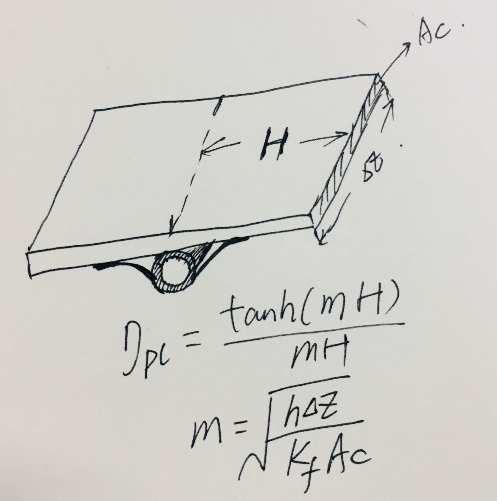

[TOC]

# 
第二章&emsp;&emsp;冰箱系统的换热器设计

 
&emsp;&emsp;本章所述换热器，主要指冰箱的冷凝器和蒸发器,一种装在冰箱的外表面向环境排放热量，一种装在冰箱里面吸收箱内的热量，两种用途的换热器都是间壁式换热器，间壁内外侧换热介质为制冷剂和空气，在蒸发器和冷凝器正常工作时，冷凝器内发生的是气-液相变的过程，伴随着潜热的释放;蒸发器内是液-气的相变过程，伴随着潜热的吸收。由于制冷剂处于两相流状态时，其传热性能最好，所以冰箱系统的冷凝器和蒸发器要保证足够长的管路维持在两相态才能获得良好的传热性能。

&emsp;&emsp;综合来看冰箱系统使用的换热器，其主要特征如下：
>1、冰箱产品的热负荷都不高，传热温差一般都需要控制在10$^\circ $C 以下,在能耗测试工况下甚至传热温差要低于5$^\circ $C。
>2、制冷剂侧有相变（冷凝/沸腾）传热，传热系数远高于空气侧。
>3、空气侧传热系数较低，即使是强制对流的风冷换热器，传热系数也比制冷剂侧低两个数量级，一般都在30$W  m^{-2}K^{-1}$以下，空气侧传热面积远大于制冷剂侧。
>4、制冷剂管路较细，内管水力直径一般在2～8mm之间。
>5、制冷剂工作压力不高，但对防腐蚀性能要求很高。
>6、要求体积小，换热面积大，需要满足苛刻的容积和耗电量指标要求。

&emsp;&emsp;冰箱换热器根据用途分为冷凝器和蒸发器两种，根据空气的流动特点分为强制对流（风冷）和自然对流（直冷）,常见类型有：
>1 Plate-Tube   板管式
>2 Fin-Tube     管翅式
>3 Wire-Tube    丝管式
 

&emsp;&emsp;换热器的设计目标就是实现流阻、热阻、体积、成本和可靠性等的最优化设计方案，冰箱换热器的结构设计非常简单，会画换热器和会设计换热器完全是两码事，要想给出优化的换热器设计方案，必须要对换热器的定量/定性分析理论有深入的理解，对不同类型冰箱产品的换热器设计特点有充分的了解，还要对换热器和冰箱系统匹配的原理有科学并且全面的认识。

&emsp;&emsp;本章首先复习传热原理和概念，然后对冰箱系统换热器的特征和设计关键点进行分析，接着论述冰箱系统设计和换热器设计的匹配原理，最后介绍优化换热器设计的方法和途径

## 一、换热器的基本概念
&emsp;&emsp;本章需要讲述换热器的几个基本概念，如果不熟悉请自行复习《传热学》相关章节的内容，这些内容是掌握换热器定量分析方法的基础。可参考杨世铭版[1]和或Cengel的[2]，本章主要参考Cengel的书。

### 1.1 热阻
类比欧姆定律：$$ R = \frac{U}{I} $$
热阻定义为：
$$ R = \frac{\Delta T}{Q} $$
根据牛顿传热定律：
$$ Q = UA\Delta T $$ U为总传热系数，A为总传热面积,则有：

 $$ R = \frac{1}{UA} $$
 制冷管道的传热热阻为：

  

$$ R_{total} = R_i+R_{wall}+R_o=\frac{1}{h_iA_i}+\frac{ln(D_o/D_i)}{2\pi kL}+\frac{1}{h_oA_o}$$
带翅片管的热阻：
$$ R_{total} = R_i+R_{wall}+R_o=\frac{1}{h_iA_i}+\frac{ln(D_o/D_i)}{2\pi kL}+\frac{1}{h_o(A_o+\eta_fA_f)}$$
### 1.2 翅片效率
&emsp;&emsp;翅片效率：($H$为翅片高度，$p$为翅片截面周长，$k_f$为翅片的导热系数，$A_f$为翅片截面积)
$$ \eta_{fin}=\frac{Actual \space heat\space  transfer\space  rate\space  from\space  the\space  fin}{Ideal \space heat\space  transfer\space  rate\space  from\space  the\space  fin}=\frac{ tanh(mH)} {mH}$$
$$m = \sqrt{\frac{h_op}{k_fA_f}}$$
$mH$为无量纲数，翅片效率$\eta_{fin}$随$mH$值大小变化如图：

  

对于板管式换热器，与空气换热面为单侧，p只能取一半

  

从上图可知，如果空气侧传热系数低，使用长翅片可以获得较高的总传热面积，但如果空气侧传热性能较好，则应考虑使用较低的翅片高度，可以节省材料消耗；这就是：

>1 高效低翅
>2 低效高翅

### 1.3 制冷剂侧流动阻力和传热系数
&emsp;&emsp;制冷剂侧的流动阻力受管道长度、管道的水力直径和制冷剂流量的影响较大；管道内部的几何形状，粗糙度和弯头数量也会影响制冷剂在管道内的流动阻力。
$$ \Delta P =f\frac{8}{\pi^2}\frac{L}{D^5}\frac{\dot{m}^2}{\rho} $$
$f$为Darcy friction factor.
在流量不变的条件下，管道水力直径对流阻影响很大，所以一般不建议使用低水力直径的管路，除非并联连接；通常规格的冰箱换热器，其流动阻力一般不会对系统性能产生显著的影响。
Gnielinski Equation：
$$ Nu_{Dh}=\frac{(f/8)(Re_{Dh}-1000)Pr}{1+12.7(f/8)^{0.5}(Pr^{2/3}-1)} $$
Validity:
$$ 0.5<Pr<2000$$
$$3000<Re_{Dh}<5 * 10^6 $$ 

&emsp;&emsp;制冷剂侧的传热性能和制冷剂的状态有很大关系，当制冷剂全为气态时，流速较快，其传热系数在$10^2Wm^{-2}K^{-1}$数量级上；而当进入了饱和段，由于在管道内形成了相变传热区域，其传热系数会升高至$10^3Wm^{-2}K^{-1}$，所以此段的传热效率最高，在实际设计换热器时，要保证此段的长度和空气侧传热性能最大化；当进入了过冷段后，液态制冷剂流速较慢，制冷剂侧传热系数降至$10Wm^{-2}K^{-1}$的数量级。
### 1.4 空气侧传热系数和流动阻力
&emsp;&emsp;当冰箱换热器的空气侧为自然对流换热时，称之为“直冷”式换热器，其空气侧传热系数一般都低于$10Wm^{-2}K^{-1}$；而当空气侧为强制对流换热时，称之为“风冷”式换热器，由于冰箱系统的通风量较小,所以风冷式冰箱换热器的空气侧传热系数也仅比直冷式高一倍左右，一般在$(20 - 35)Wm^{-2}K^{-1}$左右。
&emsp;&emsp;由于冰箱换热器的制冷剂侧和空气侧传热性能差异非常大，在换热器设计合理，相变传热面积占比较高的状态下，制冷剂侧和空气侧传热系数相差2个数量级，所以冰箱冷凝器和蒸发器的热阻都集中在空气侧，其占比超过80%（西交大2017年家电技术大会报告数据），所以冰箱系统的传热性能强化主要集中在改善空气侧传热性能上。
&emsp;&emsp;一般情况下，强制对流换热器的空气侧风速越高，对流换热性能越好，但驱动空气流动也是要耗费电能的，通风量越大，所需要的电机功率就越高，但电冰箱是对耗电量斤斤计较的铁公鸡，使用大风量通风机是不现实的，事实上，我们现在使用的最大通风量的直流风机，其额定功率也在$3W$以下，所以我们要提高空气侧传热性能，基本没办法靠增大风机通风量来实现。

### 1.5 换热器的结构设计指标
&emsp;&emsp;换热器的有效传热面积：
与空气相接触的换热器表面积为传热面积：以制冷剂管道温度为基准：
$$ Q = h_aA_t(T_{air}-T_{tube})+h_aA_f(T_{air}-T_{fin})=h_a(A_o+\eta_fA_f)(T_{air}-T_{tube})$$
$$ A_{total}= \frac{Q}{h_a(T_{air}-T_{tube})}=A_t+\eta_fA_f$$
&emsp;&emsp;换热器的传热面积密度：$V_h$为换热器的体积
$$ \beta_o = \frac{A_{total}}{V_h} =\frac{A_o+\eta_fA_f}{V_h}$$
实际冰箱换热器的设计，尤其是翅片式蒸发器和风冷冷凝器，传热面积密度是一个非常重要的设计指标。
## 2 常见冰箱换热器种类和性能分析
&emsp;&emsp;冰箱换热器根据用途分为冷凝器和蒸发器两种，根据空气的流动特点分为强制对流（风冷）和自然对流（直冷）,常见类型有：
>1 Plate-Tube   板管式
>2 Fin-Tube     管翅式
>3 Wire-Tube    丝管式
 

以上这三种形式的换热器均可作为蒸发器和冷凝器使用，但由于使用环境的不同，其结构形式和性能参数会有很大变化，不能随便照抄。

### 2.1 板管式
&emsp;&emsp;板管式冷凝器最常见的就是冰箱的内藏式侧板冷凝器和冷柜的内胆绕管式蒸发器，以及直冷冰箱的铝板管冷藏蒸发器。便宜、不占空间、传热面积可大可小，是这种换热器最大的优点；其最大的短板就是空气侧传热性能很差，作为侧板冷凝器使用时，空气侧传热系数在$10Wm^{-2}K^{-1}$以下，作为冷柜蒸发器使用时，其空气侧传热系数也大约在$15Wm^{-2}K^{-1}$以下。
&emsp;&emsp;板管式换热器都贴附在箱体的金属表面（直冷冰箱冷藏蒸发器除外），基本不占用箱体内外部空间，所以其表面积可以做的很大，部分弥补了其空气侧性能差的缺点，而且由于空气侧传热系数低，内部贴附制冷剂管路的间距也可以做的比较稀疏，一般来讲，对于冷凝器，间距60～70mm就够了，对于内藏式蒸发器，间距在50～50mm也就能够使金属表面的翅片效率到达90%以上。

#### 2.1.1 内藏式冷凝器
&emsp;&emsp;内藏式冷凝器的性价比吊打任意类型的冰箱冷凝器，一根钢管弯成蛇形然后用铝箔纸贴在冰箱的侧板内侧，虽然传热系数小，但由于冰箱外表面积大，只要用铝箔把钢管和侧板贴好，就能把冰箱的外表面变成换热器的空气侧传热面，而且由于空气侧传热系数很低，所以也不需要把钢管排布间距做小，基本在60mm以上都可以满足要求了。
&emsp;&emsp;内藏式冷凝器最大的问题就是，它会增加箱体的热负荷，因为冷凝管道的热量也会通过发泡箱体传递给箱内空气，所以如果遇到传热面积小需要增大传热面积的情况下，需要权衡式增大传热面积的好处和增加箱体的漏热量带来的坏处。
&emsp;&emsp;设计内藏式冷凝器的原则是：
>>1尽量排满能贴冷凝器的面
>>2贴冷凝器面发泡层不能太薄
>>3管道间距不要太小，浪费管道
 

权衡增大传热面积和增加箱体热负荷的损益，尤其是小容积冰箱，本身侧板面积就不大，冷凝器面积明显偏小，此时要增加冷凝器的换热面积时要慎重考虑。
&emsp;&emsp;把管道压扁再贴侧板并不能显著增强冷凝器的传热性能，因为冷凝器的物理传热面积并没有增大，最多是理论上侧板的翅片效率提升，有效换热面积略微增大，并不能显著提升冰箱的冷凝器的传热性能。

#### 2.1.2 绕管式蒸发器
&emsp;&emsp;冷柜的绕管式蒸发器性价比吊打全部其它任意种类蒸发器，而且其蒸发器的工况是所有直冷风冷冰箱中最好的。因为内胆面积都变成了传热面积。
&emsp;&emsp;由于冷柜箱内空气传热也是自然对流，其传热系数也不高，所以在设计和排布时也不需要把管道间距做的过窄，一般情况下，50mm以上就足够了，最小也不要低于铝箔纸的宽度
### 2.2 管翅式

&emsp;&emsp;翅片效率：($H$为翅片高度，$p$为翅片截面周长，$k_f$为翅片的导热系数，$A_f$为翅片截面积)
$$ \eta_f =\frac{ tanh(mH)} {mH}$$
$$m = \sqrt{\frac{h_op}{k_fA_f}}$$
#### 1.1.2 换热器的设计指标

#### 1.1.3 空气侧传热性能和流动阻力，$j$因子 与$f$因子
风冷换热器依靠风机驱动空气流动来增强空气侧的传热性能，如果阻力比较高，则会造成风机泵功率增大，造成系统能耗偏高，因此在设计翅片式换热器，尤其是箱内使用的翅片式蒸发器时，不仅要获得良好的空气侧传热性能，还要降低蒸发器的空气侧流动阻力，以保证风机泵功率最小化，同时保证系统制冷量传输的可靠性要求。（传热性能不好，只是想要钱；流动性能不好，那是想要命）

#### 1.1.4 常见翅片效率的计算（低效高翅，高效低翅）
### 1.2 换热器的空气侧和制冷剂侧的传热和流动特性
#### 1.2.1 制冷剂状态变化对制冷剂侧传热的影响
&emsp;&emsp;制冷剂侧的传热性能和制冷剂的状态有很大关系，当制冷剂全为气态时，流速较快，其传热系数在$10^2Wm^{-2}K^{-1}$数量级上；而当进入了饱和段，由于在管道内形成了相变传热区域，其传热系数会升高至$10^3Wm^{-2}K^{-1}$，所以此段的传热效率最高，在实际设计换热器时，要保证此段的长度和空气侧传热性能最大化；当进入了过冷段后，液态制冷剂流速较慢，制冷剂侧传热系数降至$10Wm^{-2}K^{-1}$的数量级，因此冷凝器的过冷段加长，并不能有效提高冷凝器的设计容量。
#### 1.2.2 制冷剂侧的流动阻力

#### 1.2.3 空气侧对流特性对传热的影响

#### 1.2.4 风机、结霜对翅片蒸发器的性能的影响 
&emsp;&emsp;由于冰箱系统的总热负荷很小，在早期大都使用自然对流换热器来制作冷凝器和蒸发器，如丝管冷凝器/蒸发器，板管式蒸发器/冷凝器，其特点是空气侧传热性能都比较差，传热系数一般都低于$10Wm^{-2}K^{-1}$，所以增大设计容量一般都是靠增加管路长度，增大传热面积来实现，这就需要大幅增加材料成本，在设计大容积冰箱时非常不经济并且性能非常差。

&emsp;&emsp;强制对流换热器的空气侧传热系数
一般来说，空气侧传热系数都不高，
&emsp;&emsp;强制对流换热器的空气侧压降

## 二、测量、估算冰箱换热器性能的方法
&emsp;&emsp;测量换热器性能需要使用专门的仪器设备，冰箱用的需要结合风道进行测试，风道

## 三、冰箱设计对换热器性能的影响

## 四、各常用类型换热器的设计原则和优化方法

&emsp;&emsp;常见的冰箱产品，容积从几十升到数百升，发泡层厚度都至少在40mm以上，工作环境温度最高也在50摄氏度以下，所以总体来看，不能随便照抄。我们必须先从系统和换热器的基本原理入手，才能掌握冰箱换热器设计的规律和科学方法。

&emsp;&emsp;冰箱换热器为
&emsp;&emsp;当冰箱工作时，冷凝器入口一般为高温过热气态制冷剂，在冷凝器内降温形成饱和气体，再经过冷凝成为液态制冷剂，液态制冷剂进一步降温形成过冷液体，所以冷凝管路可以分为三段：过热段、饱和段和过冷段，其管线温度变化如图1,过热段为气态制冷剂释放显热，气态制冷剂与管壁之间的传热系数较低，在管内高流速条件下，其传热系数在$10^2Wm^{-2}K^{-1}$数量级上；而当进入了饱和段，由于在管道内形成了相变传热区域，其传热系数会升高至$10^3Wm^{-2}K^{-1}$，所以此段的传热效率最高；当进入了过冷段后，液态制冷剂流速较慢，制冷剂侧传热系数降至$10Wm^{-2}K^{-1}$的数量级。
&emsp;&emsp;我们在设计冷凝器是，要保证在最大负荷条件下，冷凝器末端也有稳定的过冷段，以保证进入毛细管的制冷剂干度最低，所以需要在有限长度的制冷剂流通管路条件下，尽量设计出更高的传热面积，增强换热量。
