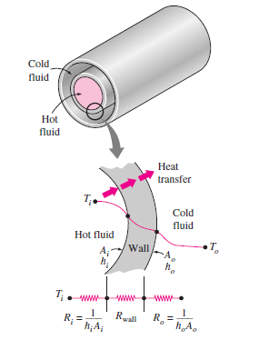

[TOC]

# 
第二章&emsp;&emsp;冰箱系统的换热器设计

&emsp;&emsp;本章主要介绍冰箱换热器的性能特点，传热原理和优化设计方法，首先介绍相关的传热学描述方法，然后对冰箱系统换热器的特征和设计关键点进行分析，接着论述冰箱系统设计和换热器设计的配合方法，最后介绍优化、创新换热器设计的方法和途径

## 一、换热器的基本概念

### 1.1 热阻
类比欧姆定律：$$ R = \frac{U}{I} $$
热阻定义为：
$$ R = \frac{\Delta T}{Q} $$
根据牛顿传热定律：
$$ Q = UA\Delta T $$ U为总传热系数，A为总传热面积,则有：

 $$ R = \frac{1}{UA} $$
 制冷管道的传热热阻为：

  

$$ R_{total} = R_i+R_{wall}+R_o=\frac{1}{h_iA_i}+\frac{ln(D_o/D_i)}{2\pi kL}+\frac{1}{h_oA_o}$$
带翅片管的热阻：
$$ R_{total} = R_i+R_{wall}+R_o=\frac{1}{h_iA_i}+\frac{ln(D_o/D_i)}{2\pi kL}+\frac{1}{h_o(A_o+\eta_fA_f)}$$
### 1.2 翅片效率
&emsp;&emsp;翅片效率：($H$为翅片高度，$p$为翅片截面周长，$k_f$为翅片的导热系数，$A_f$为翅片截面积)
$$ \eta_{fin}=\frac{Actual \space heat\space  transfer\space  rate\space  from\space  the\space  fin}{Ideal \space heat\space  transfer\space  rate\space  from\space  the\space  fin}=\frac{ tanh(mH)} {mH}$$
$$m = \sqrt{\frac{h_op}{k_fA_f}}$$
$mH$为无量纲数，翅片效率$\eta_{fin}$随$mH$值大小变化如图：

  

### 1.3 制冷剂侧流动阻力和传热系数
&emsp;&emsp;制冷剂侧的流动阻力受管道长度、管道的水力直径和制冷剂流量的影响较大；管道内部的几何形状，粗糙度和弯头数量也会影响制冷剂在管道内的流动阻力。
$$ \Delta P =f\frac{8}{\pi^2}\frac{L}{D^5}\frac{\dot{m}^2}{\rho} $$
$f$为Darcy friction factor.
在流量不变的条件下，管道水力直径对流阻影响很大，所以一般不建议使用低水力直径的管路，除非并联连接；通常规格的冰箱换热器，其流动阻力一般不会对系统性能产生显著的影响。
&emsp;&emsp;制冷剂侧的传热性能和制冷剂的状态有很大关系，当制冷剂全为气态时，流速较快，其传热系数在$10^2Wm^{-2}K^{-1}$数量级上；而当进入了饱和段，由于在管道内形成了相变传热区域，其传热系数会升高至$10^3Wm^{-2}K^{-1}$，所以此段的传热效率最高，在实际设计换热器时，要保证此段的长度和空气侧传热性能最大化；当进入了过冷段后，液态制冷剂流速较慢，制冷剂侧传热系数降至$10Wm^{-2}K^{-1}$的数量级。
### 1.4 空气侧传热系数和流动阻力

### 1.5 换热器的结构设计指标

### 1.1 换热器的基本性能参数
#### 1.1.1 管道的热阻与翅片效率
&emsp;&emsp;光管的热阻：

&emsp;&emsp;翅片效率：($H$为翅片高度，$p$为翅片截面周长，$k_f$为翅片的导热系数，$A_f$为翅片截面积)
$$ \eta_f =\frac{ tanh(mH)} {mH}$$
$$m = \sqrt{\frac{h_op}{k_fA_f}}$$
#### 1.1.2 换热器的设计指标
&emsp;&emsp;换热器的传热面积密度：$V_h$为换热器的体积
$$ \beta_o = \frac{A_{total}}{V_h} =\frac{A_o+\eta_fA_f}{V_h}$$
&emsp;&emsp;基本传热单元分析法
将换热器分割为最小的周期性排列的传热单元，然后计算该单元的有效换热面积和占用体积，可以很方便的估算出其换热器的传热面积密度：
以下是几个例子：

#### 1.1.3 空气侧传热性能和流动阻力，$j$因子 与$f$因子
风冷换热器依靠风机驱动空气流动来增强空气侧的传热性能，如果阻力比较高，则会造成风机泵功率增大，造成系统能耗偏高，因此在设计翅片式换热器，尤其是箱内使用的翅片式蒸发器时，不仅要获得良好的空气侧传热性能，还要降低蒸发器的空气侧流动阻力，以保证风机泵功率最小化，同时保证系统制冷量传输的可靠性要求。（传热性能不好，只是想要钱；流动性能不好，那是想要命）

#### 1.1.4 常见翅片效率的计算（低效高翅，高效低翅）
### 1.2 换热器的空气侧和制冷剂侧的传热和流动特性
#### 1.2.1 制冷剂状态变化对制冷剂侧传热的影响
&emsp;&emsp;制冷剂侧的传热性能和制冷剂的状态有很大关系，当制冷剂全为气态时，流速较快，其传热系数在$10^2Wm^{-2}K^{-1}$数量级上；而当进入了饱和段，由于在管道内形成了相变传热区域，其传热系数会升高至$10^3Wm^{-2}K^{-1}$，所以此段的传热效率最高，在实际设计换热器时，要保证此段的长度和空气侧传热性能最大化；当进入了过冷段后，液态制冷剂流速较慢，制冷剂侧传热系数降至$10Wm^{-2}K^{-1}$的数量级，因此冷凝器的过冷段加长，并不能有效提高冷凝器的设计容量。
#### 1.2.2 制冷剂侧的流动阻力

#### 1.2.3 空气侧对流特性对传热的影响
&emsp;&emsp;当冰箱换热器的空气侧为自然对流换热时，称之为“直冷”式换热器，其空气侧传热系数一般都低于$15Wm^{-2}K^{-1}$；而当空气侧为强制对流换热时，称之为“风冷”式换热器，由于冰箱系统的通风量较小,所以风冷式冰箱换热器的空气侧传热系数也仅比直冷式高一倍左右，一般在$(20 - 35)Wm^{-2}K^{-1}$左右。
&emsp;&emsp;由于冰箱换热器的制冷剂侧和空气侧传热性能差异非常大，在换热器设计合理，相变传热面积占比较高的状态下，制冷剂侧和空气侧传热系数相差2个数量级，所以冰箱冷凝器和蒸发器的热阻都集中在空气侧，其占比超过80%（西交大2017年家电技术大会报告数据），所以冰箱系统的传热性能强化主要集中在改善空气侧传热性能上。
&emsp;&emsp;一般情况下，强制对流换热器的空气侧风速越高，对流换热性能越好，但驱动空气流动也是要耗费电能的，通风量越大，所需要的电机功率就越高，但电冰箱是对耗电量斤斤计较的铁公鸡，使用大风量通风机是不现实的，事实上，我们现在使用的最大通风量的直流风机，其额定功率也在$3W$以下，所以我们要提高空气侧传热性能，基本没办法靠增大风机通风量来实现。

#### 1.2.4 风机、结霜对翅片蒸发器的性能的影响 
&emsp;&emsp;由于冰箱系统的总热负荷很小，在早期大都使用自然对流换热器来制作冷凝器和蒸发器，如丝管冷凝器/蒸发器，板管式蒸发器/冷凝器，其特点是空气侧传热性能都比较差，传热系数一般都低于$10Wm^{-2}K^{-1}$，所以增大设计容量一般都是靠增加管路长度，增大传热面积来实现，这就需要大幅增加材料成本，在设计大容积冰箱时非常不经济并且性能非常差。

&emsp;&emsp;强制对流换热器的空气侧传热系数
一般来说，空气侧传热系数都不高，
&emsp;&emsp;强制对流换热器的空气侧压降

## 二、测量、估算冰箱换热器性能的方法
&emsp;&emsp;测量换热器性能需要使用专门的仪器设备，冰箱用的需要结合风道进行测试，风道

## 三、冰箱设计对换热器性能的影响

## 四、各常用类型换热器的设计原则和优化方法

&emsp;&emsp;常见的冰箱产品，容积从几十升到数百升，发泡层厚度都至少在40mm以上，工作环境温度最高也在50摄氏度以下，所以总体来看，冰箱产品的热负荷都不高，匹配压缩机的输入功率一般都在1/2hp以下，所以对换热器的设计容量要求不高，可以实现制冷系统的小型化设计，综合来看冰箱系统使用的换热器，其主要特征如下：
>1、除毛细管-回气管外，其它都为空气-液（制冷剂）换热
>2、制冷剂侧有相变（冷凝/沸腾）传热，传热系数远高于空气侧
>3、空气侧传热系数较低，即使是强制对流的风冷换热器，传热系数也比制冷剂侧低两个数量级，一般都在60$W  m^{-2}K^{-1}$以下
>4、换热量要求不高，但要求体积小，重量轻，成本低廉 

&emsp;&emsp;冰箱换热器根据用途分为冷凝器和蒸发器两种，根据空气的流动特点分为强制对流（风冷）和自然对流（直冷）,常见类型有：
>1 Plate-Tube   板管式
>2 Fin-Tube     管翅式
>3 Wire-Tube    丝管式
 

以上这三种形式的换热器均可作为蒸发器和冷凝器使用，但由于使用环境的不同，其结构形式和性能参数会有很大变化，不能随便照抄。我们必须先从系统和换热器的基本原理入手，才能掌握冰箱换热器设计的规律和科学方法。

&emsp;&emsp;冰箱换热器为
&emsp;&emsp;当冰箱工作时，冷凝器入口一般为高温过热气态制冷剂，在冷凝器内降温形成饱和气体，再经过冷凝成为液态制冷剂，液态制冷剂进一步降温形成过冷液体，所以冷凝管路可以分为三段：过热段、饱和段和过冷段，其管线温度变化如图1,过热段为气态制冷剂释放显热，气态制冷剂与管壁之间的传热系数较低，在管内高流速条件下，其传热系数在$10^2Wm^{-2}K^{-1}$数量级上；而当进入了饱和段，由于在管道内形成了相变传热区域，其传热系数会升高至$10^3Wm^{-2}K^{-1}$，所以此段的传热效率最高；当进入了过冷段后，液态制冷剂流速较慢，制冷剂侧传热系数降至$10Wm^{-2}K^{-1}$的数量级。
&emsp;&emsp;我们在设计冷凝器是，要保证在最大负荷条件下，冷凝器末端也有稳定的过冷段，以保证进入毛细管的制冷剂干度最低，所以需要在有限长度的制冷剂流通管路条件下，尽量设计出更高的传热面积，增强换热量。
