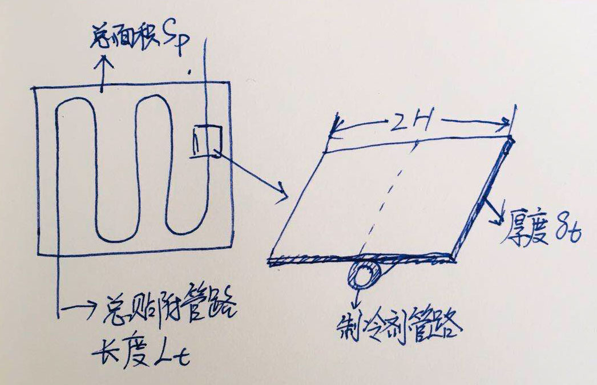
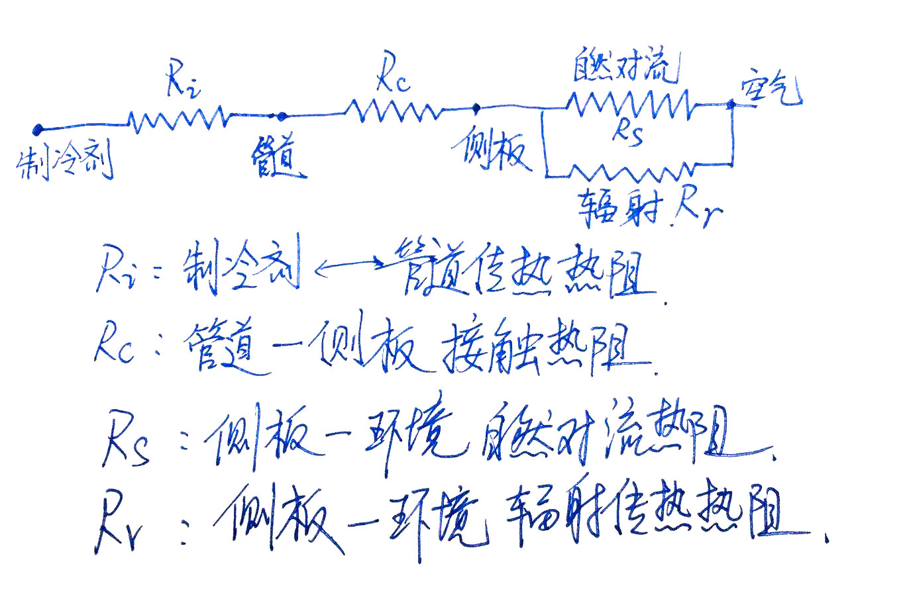
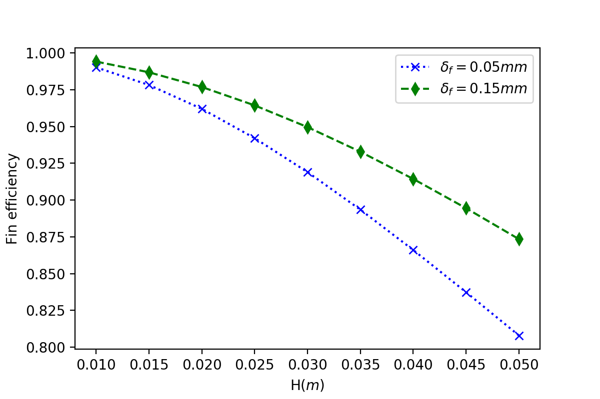

# 
 第二章&emsp;&emsp;冰箱系统的换热器设计 

[toc]

## 一、换热器相关基本概念

### 1.1 冰箱换热器的类型 

&emsp;&emsp;冰箱换热器的特点如下：
换热器为间壁式换热器，由金属管道和翅片构成
制冷剂和空气两种传热介质换热，制冷剂通常处于两相态，制冷剂侧传热系数高，空气侧传热系数低。
单纯管道的空气侧传热面积太小，需要对制冷剂管道在结构上进行肋化以扩展表面积
冰箱使用的冷凝器和蒸发器从严格意义上讲都是管翅式换热器，管内为制冷剂通路，管外为自然对流空气或者强制对流空气，从空气侧的换热特点分类，有如下几种：
> 自然对流换热器
>> 板管式换热器
>>> 侧板式冷凝器
>>> 内胆绕管式蒸发器

> 强制对流换热器
>> 管翅式
>>> 推入式
>>> 胀管式
>>> 旋翅式
>>> 微通道翅片式

### 1.2 冰箱换热器的传热温差

### 1.3 管道水力直径与管道流动阻力

### 1.4 空气侧传热面积与传热面积密度

### 1.5 翅片式换热器的空气侧流动阻力与系统风量

### 1.6 冰箱换热器的总热阻与总传热系数

## 二、 常用冰箱换热器的设计原则

### 2.1 板管式换热器
&emsp;&emsp;冰箱用的板管式换热器通常为自然对流（直冷）式换热器，不需要风机，其与空气接触面为平面，管道附着在平板的另一侧,依靠焊接或者铝箔贴附的方法与平板形成良好的热接触。此类换热器的优/缺点如下：

|优点|缺点|
|:--:|:--:|
|不占用箱体有效容积|换热面积有限，设计容量不高|
|制作简单，成本低|增加箱体的热负荷|
||设计容量受箱体表面尺寸制约|

冰箱常用的板管式有侧板式冷凝器、直冷冷藏蒸发器、绕管式冷冻蒸发器等。此类换热器的换热板面一般就是冰箱的内表面或者外表面，管道与冰箱内外表面的接触热阻占总热阻的比例在5%以下，提高其性能主要靠以下两种途径：
1、 扩展换热面积
2、提高板管的肋化效率

#### 2.1.1 板管式换热器的基本原理
&emsp;&emsp;板管式换热器的基本结构如图所示,通常情况下，管道要均匀贴满整个换热板面,以便于最大限度增强空气侧传热面积，但因为空气侧自然对流传热系数较低，所以不需要将制冷剂管路紧密排列，一般情况下，保持在85%~90%左右的翅片效率即可。
&emsp;&emsp;板管式换热器的总热阻如图 所示：制冷剂侧热阻占比一般在10%~ 15%左右，管壁热阻占比在1%以下，可忽略不计，管路与平板的接触热阻占比在2%~5%左右，而平板与空气热阻占总热阻的80%以上，要降低板管换热器的总热阻，最重要的是降低空气侧热阻，在制冷剂侧热阻和管壁-平板接触热阻上做文章是徒劳的。

fig.

由于管路在平板上均匀分布，则相当于一个长度为$L_t$,面积为$A_p$的细长板管，其宽度为2H，其空气侧热阻计算方法如下：

$ H = \frac{A_p}{2L_t} $

$ R_4= \frac{1}{{UA}_{p}}=\frac{1}{h_aA_{p}\eta_{p}}  $

$ \eta_p = \frac{tanh(mH)}{mH}$

$m = \sqrt{\frac{h}{k_p\delta_p}} $
$ A_{eff} = A_p\eta_f$

其中$k_p$为平板的导热系数，单位：$Wm^{-2}K^{-1}$  $\delta_P $ 为平板的厚度,单位：$m$.

#### 2.1.2 侧板冷凝器的设计
&emsp;&emsp;侧板冷凝器是最常用的冰箱冷凝器形式，将钢管加工成蛇形管，然后用铝箔纸贴附在冰箱侧板内侧，铝箔不仅起粘结作用，而且起到了减小管道与侧板的接触热阻，提高侧板的“翅片效率”。

&emsp;&emsp;侧板的翅片效率，通常设计要求$$\eta_f$$>= 90% ，我们常用的侧板厚度$\delta_p=0.4mm$,冷轧钢板导热系数$k_p=50Wm^{-1}K^{-1}$,铝箔厚度按照$\delta_f =0.1mm$,导热系数$k_f = 220Wm^{-1}K^{-1}$W,侧板排布管道的间距为2H，,空气侧自然对流系数取$h_a=9Wm^{-2}K^{-1}$W则有：
$$  \eta_p = \frac{tanh(mH)}{mH}$$

$$m = \sqrt{\frac{h_a}{k_p\delta_p+k_f\delta_f}} $$
H取10～50mm，计算结果如图: 我们常用的侧板冷凝器的盘管间距有60,70mm两种状态,对应翅片效率$\eta_{H30}=0.92$, $\eta_{H35}=0.89$,对于相同面积的侧板,有效热面积差异仅3%;如果下血本使用0.15mm厚的铝箔,理论上则可以提升4%的有效传热面积。

根据以上分析，侧板冷凝器的设计要求如下：

+ 1    尽量把冷凝器均匀贴满左右侧板，让侧板变成冷凝器的传热表面。
+ 2    冷凝器管道太密，浪费成本；太稀，有效换热面积减小，系统循环效率降低；按照上述公式计算，管道间距设计能够让侧板的翅片效率达到90%左右即可。
+ 3    当冷凝面积已经足够（测试冷凝温度与环境温度差值在5~7度以内），则不建议再增加贴附冷凝器面积。
+ 4    需要时可在冰箱的其它金属外表面贴附冷凝器，如U壳顶部或者后背板上。

#### 2.1.3 冰柜绕管蒸发器的设计
&emsp;&emsp;冰柜的绕管蒸发器是将管道缠绕在金属内胆外侧，然后用铝箔把管道和内胆贴紧，铝箔起到了减小接触热阻和强化内胆的翅片效率的作用。
&emsp;&emsp;通常情况下，内胆绕管间距不能大于贴的铝箔的宽度，一般选择50~60mm即可，像有的产品间距25mm就属于浪费了。
&emsp;&emsp;也有在塑料内胆上绕管贴铝箔做冷冻蒸发器的，排布间距需要小一些，使用窄铝箔，没必要铝箔贴铝箔。

### 2.2 管翅式
&emsp;&emsp;翅片式蒸发器的基本结构是管道插入翅片或者翅片环绕盘管。
#### 2.2.1 管翅式换热器的基本原理

#### 2.2.2 穿入翅片式

#### 2.2.3 旋翅式

#### 2.2.4 微通道翅片式

#### 2.2.5 为啥不在管翅式上用异形管

### 3.3 微通道翅片式

## 三、 换热器性能的测量和估算
&emsp;&emsp;冰箱用换热器的性能最重要的参数就是换热器的热阻、制冷剂侧流阻和空气侧流阻
### 3.1 换热量测试台

### 3.2 系统参数估算法

## 四、 换热器与冰箱系统的相互影响

### 4.1 箱体几何尺寸

### 4.2 蒸发器占用空间

### 4.3 换热器内容积与系统充液量

### 4.4 换热器性能与风机、风道系统的关系

### 4.5 整机噪音与换热器性能的关系

## 五、 换热器设计的优化方向

### 5.1 改善空气侧传热和流动性能

### 5.2 增大传热面积密度

### 5.3 降低成本

