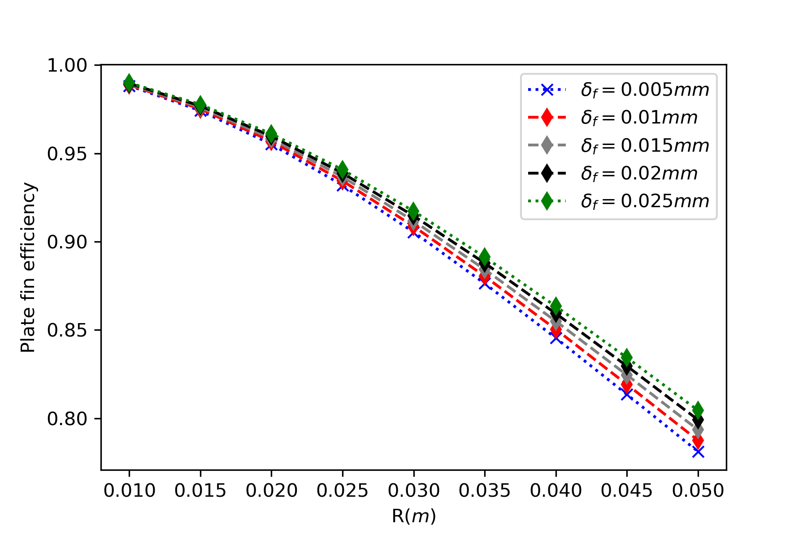
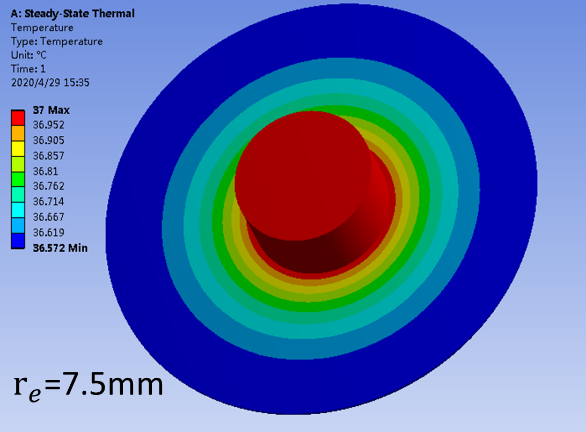

[toc]
# 第二章 冰箱换热器设计
 
&emsp;&emsp;本章所述换热器，主要指冰箱的冷凝器和蒸发器,一种装在冰箱的外表面向环境排放热量，一种装在冰箱内部吸收箱内的热量，两种用途的换热器都是间壁式换热器，间壁内外侧换热介质为制冷剂和空气，在蒸发器和冷凝器正常工作时，冷凝器内发生的是气-液相变的过程，伴随着潜热的释放;蒸发器内是液-气的相变过程，伴随着潜热的吸收。由于制冷剂侧使用相变传热，大幅减小了换热器的制冷剂侧热阻，从而使冰箱的换热器体积大幅缩小，成为一件人工就能搬的动的家用电器。

&emsp;&emsp;根据空气侧的流动特点分为强制对流（风冷）和自然对流（直冷）,常见类型有：
>1 Plate-Tube   板管式
>2 Fin-Tube     平直翅片式
>3 旋翅式
>3 Wire-Tube    丝管式
>4 louver fin and flat tube 百叶窗扁管式（微通道式）

&emsp;&emsp;综合来看冰箱系统使用的换热器，其主要特征如下：
+ 1、冰箱产品的热负荷都不高，传热温差一般都需要控制在10$^\circ $C 以下,在能耗测试工况下甚至传热温差要低于5$^\circ $C。
+ 2、制冷剂侧有相变（冷凝/沸腾）传热，传热系数远高于空气侧。
+ 3、空气侧传热系数较低，即使是强制对流的风冷换热器，传热系数也比制冷剂侧低两个数量级，一般都在30$W  m^{-2}K^{-1}$以下，空气侧传热面积远大于制冷剂侧。
+ 4、制冷剂管路较细，内管水力直径一般在2～8mm之间。
+ 5、制冷剂工作压力不高，但对防腐蚀性能要求很高，要求焊点尽量少。
+ 6、要求体积小，换热面积大，需要满足苛刻的容积和耗电量指标要求。

&emsp;&emsp;本章首先从传热学基本概念入手，描述冰箱换热器的性能，介绍分析换热器性能的理论和实验方法，最后介绍冰箱换热器的设计原则和优化方法。

## 1 换热器的基本概念

### 1.1 热阻
类比欧姆定律：$$ R = \frac{U}{I} $$
热阻定义为：
$$ R = \frac{\Delta T}{Q} $$
根据傅里叶定律：
$$ Q = -k\frac{\partial T}{\partial L}A
$$
则导热过程的热阻可以写为：
$$ R_{cond}= -\frac{L}{kA}$$
根据牛顿传热定律：
$$ Q = hA\Delta T $$ h为对流传热系数，A为总传热面积,则有：

 $$ R_{conv} = \frac{1}{hA} $$
 一个具体的传热过程，可能既有传导，又有对流和辐射，整个热流输送的过程用热阻的串并联来表示，例如制冷管道的传热热阻为：

  

$$ R_{total} = R_i+R_{wall}+R_o=\frac{1}{h_iA_i}+\frac{ln(D_o/D_i)}{2\pi kL}+\frac{1}{h_oA_o}$$
带翅片管的热阻：

$$R_{total}=R_i+R_{wall}+\frac{1}{\frac{1}{R_{contact}+R_f}+\frac{1}{R_t}}
$$

其中制冷剂管内传热热阻为：
$$ R_i = \frac{1}{h_iA_i}$$
制冷管路管壁热阻为：
$$R_{wall}=\frac{ln(D_o/D_i)}{2\pi kl}$$
管壁热阻太小一般都忽略。
$ R_{contact}=\frac{1}{h_{contact}A_k}$为翅片与管道的接触热阻，由于我们所用的翅片与管道都是使用挤压或者焊接工艺，此项一般忽略。
翅片与空气热阻:
$$ R_f = \frac{1}{\eta_fh_oA_f}$$其中$\eta_f $为翅片效率。
管道与空气热阻：$$ R_t = \frac{1}{h_oA_o}$$
则在忽略管壁热阻和翅片管接触热阻之后有：
$$R_{total}=\frac{1}{h_iA_i}+\frac{1}{h_o(A_o+\eta_fA_f)}$$

我们常用的自然对流板管式
### 1.2 流动阻力
&emsp;&emsp;制冷剂在管内流动，会产生摩擦阻力，会使压缩机耗功增加，系统COP降低，根据流体摩擦阻力公式，管道长度越长，制冷剂侧流动阻力就越大。
$$\Delta P_L = f \frac{L}{D_h} \frac {\rho V_{avg}^2}{2}\space \space (2)$$ 
压缩机的质量流量为：
$$\dot{m}= \eta_{vol}V_KN/v_1
$$ 
管道平均流速$$V_{avg}= \frac{\dot{m}}{\frac{\pi}{4}\rho D^2} \tag{1}$$
则冰箱制冷剂侧管内的流动阻力可以表达为：
$$\Delta P_L = f \frac{8L}{\rho D_h^5} \frac {\dot{m}^2}{\pi^2} $$ 
$f$: Darcy friction factor 

由上式看出，在压缩机选型和工况相同时，制冷剂流动阻力和所用管道水力直径的4-5次方成反比，冰箱的制冷剂管路越细，则管道流动阻力迅速增加，因此冰箱所用管路，尤其是液相比例高的蒸发器，一般都采用较粗的管路。
&emsp;&emsp;而对于换热器的空气侧，如果为强制对流，则也需要考虑流动阻力的问题，因为风道系统如果因为换热器的空气侧阻力太高，会使系统的总通风量降低，系统换热量下降，使制冷系统的工况变差，系统COP降低。如图所示，I,II,III 为风道系统阻力曲线，从I至III，系统阻力递减，则相依风量依次提高。

&emsp;&emsp;我们常见的斜插式翅片蒸发器：其Darcyfriction factor可以表示为：

$$  f = a Re^\alpha \epsilon^\beta N^\gamma$$

其中$\epsilon$为翅片总面积与盘管空气侧面积的比值，$N$为盘管排数。
一般来讲，盘管排数越多，翅片越密，流速越快则流动阻力越大。虽然管道越长，翅片越多，则换热面积越大，但考虑到流动阻力的增加，对制冷系统的作用不一定都是正面的。
### 1.3 努塞尔数和$j$因子
&emsp;&emsp;努塞尔数表征了换热器表面的对流换热与导热之间的差异，其定义为：
$$ Nu_{D_h}= \frac {h_aD_h}{k}$$
在调整多项参数测量完换热器的换热量后，需要把数据整理成Nusselt数与各种无量纲数之间的经验公式，例如斜插式换热器的空气侧传热性能可以表示为：
$$ Nu_{D_h}= 0.162Re_D^{0.62}  Pr^{1/3} $$
使用努塞尔数可以很方便地计算换热器的在变工况下的实际性能参数。
在技术文献中，经常可以看到另一种无量纲$j$因子表示法：
$$ j = \frac{h_a}{G_a  C_{p_a}}Pr_a^{2/3} $$
而$$Re_{D_h}= G_a D_h/\mu $$
  $$ Pr= \frac{\mu C_{p_a}}{k_a}$$
则可以得到关系式为：
$$ j = \frac{Nu_{D_h}}{Re_{D_h}}Pr^{-1/3}$$
&emsp;&emsp;由于冰箱换热器的换热性能和空气侧流动性能都非常重要，在相关研究换热器文献中，一般都会给出努塞尔数和f因子,或者$j$,$f$因子的数据和拟合结果。
### 1.3 换热面积的扩展与翅片效率
&emsp;&emsp;我们通常使用的间壁式换热器的管道一般为圆管，圆管的几何特征就是周长最小的时候获得最大的截面积，所以圆管的内部和外部传热面积都很小，直接使用圆形管路来当换热器是非常不经济的,使用其它形状的管道，在水力直径不变的条件下，其管内和管外的换热面积会略有增加，但也远远达不到理想的强化传热的效果。

&emsp;&emsp;水力直径的定义：
$$ D_h =\frac{4 \cdot A_c} {p}$$
&emsp;&emsp;为了增大换热面积，最常用的方法就是对管道进行肋化，即增加翅片，用焊接、粘接和挤压的方法将翅片和管路紧密连接在一起，使接触热阻最小化，虽然翅片与传热流体之间的温差要小于管道与传热介质之间的温差，但由于翅片面积远大于圆管的外表面积，并且翅片也可以保证很高的效率，增加翅片能够获得大幅的换热面积的提升。
翅片效率的定义：$$ \eta_{fin}=\frac{Actual \space heat\space  transfer\space  rate\space  from\space  the\space  fin}{Ideal \space heat\space  transfer\space  rate\space  from\space  the\space  fin}$$
&emsp;&emsp;上式可以理解为：由于翅片与传热流体间的温差小于管道与传热流体之间的温差，为了方便计算，假设翅片面积与传热流体间的温差等于管道与流体间的温差，那么计算传热面积时翅片面积需要打得折扣就是翅片效率。
&emsp;&emsp;以空气侧传热为例，对于方形平板翅片，其翅片效率为：

$$ \eta_{f}=\frac{ tanh(mH)} {mH}$$
$$m = \sqrt{\frac{h_ap}{k_fA_c}}$$
由于通常翅片都很薄，即$L>>\delta_f$，则m可以简化为$m =\sqrt{\frac{2h_a}{k_f\delta_f}}$
$mH$为无量纲数，翅片效率$\eta_{fin}$随$mH$值大小变化如图，虽然加长翅片可以增大翅片换热面积，但可以看出，翅片越长效率越低，所以在进行换热器设计时，要根据计算结果选择合适的翅片高度和效率，冰箱换热器一般要求翅片效率在85%~90%之间。

  

## 2 冰箱换热器的结构与性能
&emsp;&emsp;在设计一款新冰箱时，需要通盘考虑结构、制冷和电气等模块的设计，制冷系统不仅要实现小型化，少占空间，还要能够实现较强的换热能力，这就对制冷系统的换热器的设计提出了非常高的要求。
理想的换热器设计目标为：
 + 低热阻
+ 占据冰箱的箱内空间少
+ 制冷剂侧摩擦阻力小，压缩机耗功低
+ 空气侧阻力小系统风量大，风机消耗功率低
+ 材料消耗少，成本低
为了实现以上目标，在实际设计中，必须理解换热器的结构及其物理性能之间的关系，作出正确的取舍，实现性能、结构和成本之间的平衡。

### 2.1 换热器的热阻构成
&emsp;&emsp;无论是自然对流换热器还是强制对流换热器，其总热阻都可以表示为一个热阻网络图，主要包括“制冷剂-管内壁热阻$R_i$”、“管壁热阻$R_{wall}$”、：“管道-翅片接触热阻$R_{contact}$”、“管外侧-空气对流热阻$R_o$”，“翅片-空气对流热阻$R_f$”等几部分。（注意翅片指起到增加空气侧传热面积的表面，如侧板冷凝器的侧板也可称之为翅片）那么这么多热阻构成部分，究竟哪块的热阻是最大的？在实际的设计中，应当怎样去优化热阻，获得最高的性价比呢？

板管式换热器热阻
&emsp;&emsp;在换热器设计当中，优化占比最大部分的热阻，才能够获得较好的强化传热效果。在冰箱用的换热器中，由于管壁很薄，$R_{wall}$忽略不计，由于管道和翅片（平板）都是使用挤压或者粘接的方法进行连接，其接触热阻一般都在1%以下，所以在计算中也不出现，对于冰箱产品使用的小型换热器，那就是强化空气侧传热热阻（$R_o+R_f$),以下将用实例介绍板管式换热器和翅片式换热器的热阻分析实例：
&emsp;&emsp;取板管式换热器一个最小的换热单元，管道长度为1m，管道规格为$\phi 8×0.75mm$，平板尺寸尺寸为$1000mm×60mm$，管内制冷剂侧传热系数为： $h_i=1000 Wm^{-2} K^{-1}$,自然对流空气侧传热系数$h_a = 10Wm^{-2} K^{-1}$,则总热阻计算如下：

计算所用参数：
|名称|代数符号|单位|数值|备注|
|:--:|:--:|:--:|:--:|:--:|
|管道长度|$L_t$|$m$|1||L_t
|翅片长度|$L_f = L_t$|$m$|1||
|翅片高度|$H_p$|$m$|$25e-3$||
|翅片厚度|$\delta_f$|$m$|$0.4e-3$||
|管道内径|$D_i$|$m$|$6.5e-3$||
|管道外径|$\phi_o$|$m$|$8.0e-3$||
|空气侧翅片面积|$A_f=2L_f\cdot H_p$|$m^2$|$50e-3$||
|空气侧管道面积|$A_o$|$m^2$|$0$||
|铝合金导热系数|$k_f$|$Wm^{-1}K^{-1}$|$227$|
|制冷剂侧传热系数|$h_i$|$Wm^{-2}K^{-1}$|$1000$|
|空气侧传热系数|$h_a$|$Wm^{-2}K^{-1}$|$10$|
|翅片效率|$\eta_f =\frac {tanh(mH)}{mH}$ $m= \sqrt{\frac{h}{k_f\delta_f}}$|$\%$|$97.7$|
|空气侧总传热面积|$A_{tot}=A_o+\eta_fA_f$|$m^2$|$48.85e-3$||
|制冷剂侧传热面积|$A_i=\pi\cdot D_i$|$m^2$|$2.04e-2$||
|制冷剂侧热阻|$R_i = \frac{1}{h_iA_i}$|$K/W$|$4.9e-2$|
|空气侧热阻|$R_o = \frac{1}{h_a(A_o+\eta_fA_f)}$|$K/W$|2.05|
|总热阻|$R_{t} = \frac{1}{h_iA_i}+\frac{1}{h_aA_{tot}}$|$K/W$|$2.07$|
|制冷剂侧热阻占比|$R_i/R_t$|$\%$|$2.3$|
|空气侧热阻占比|$R_o/R_t$|$\%$|$97.7$|

由上表可以看出，制冷剂侧热阻占比非常低，所以才用强化制冷剂侧传热的办法对总热阻贡献基本为0。
有很多人认为将铝管压扁，然后粘接到换热板面上，就能够大幅提升换热性能，这可能吗？
+ 扁管虽然面积比圆管大，但管道并不和空气直接接触，空气侧有效传热面积几乎无变化
+ 采用粘接方式的板管换热器，无论是侧板冷凝器或者冷柜绕管蒸发器，其接触热阻占比很小，在2%以下，因为铝箔起到了良好的粘接（降低接触热阻）和肋化（增强管道对板面的导热）的作用。如下图B和C，C状态扁管与侧板有4mm宽的接触面积，但使用有限元软件计算出的侧板温度分布与圆管贴铝箔相差无几；但观察A和B的差别就可以看出铝箔对增强侧板换热的重要作用。

#### 2.1.2 斜插式翅片
以双孔斜插翅片为例，一个最小的换热单元包括：4根长度5mm的管道，50*36.1的带双1字孔的翅片，其总热阻
|名称|代数符号|单位|数值|备注|
|:--:|:--:|:--:|:--:|:--:|
|管道长度|$L_t$|$m$|$5e-3$||
|管道间距|$P_t$|$m$|$22e-3$||
|翅片长度|$L_f = L_t$|$m$|$50e-3$||
|翅片高度|$L_p$|$m$|$38.1e-3$||
|翅片厚度|$\delta_f$|$m$|$1.5e-4$||
|管道内径|$D_i$|$m$|$6.5e-3$||
制冷剂侧传热面积|$A_i=\pi\cdot D_i$|$m^2$|$4.08e-04$||
|管道外径|$\phi_o$|$m$|$8.0e-3$||
|空气侧翅片面积|$A_f=2(L_f\cdot H_p-P_t\cdot D_i\cdot 2-2\cdot \pi D_i^2/4)$|$m^2$|$2.90e-3$||
|空气侧管道面积|$A_o$|$m^2$|$5.03e-4$||
|铝合金导热系数|$k_f$|$Wm^{-1}K^{-1}$|$227$|
|制冷剂侧传热系数|$h_i$|$Wm^{-2}K^{-1}$|$1000$|
|空气侧传热系数|$h_a$|$Wm^{-2}K^{-1}$|$20$|
|翅片效率|$\eta_f =\frac {tanh(mH)}{mH}$ $m= \sqrt{\frac{2h}{k_f\delta_f}}$|$\%$|$95.8$|
|空气侧总传热面积|$A_{tot}=A_o+\eta_fA_f$|$m^2$|$3.32e-3$||
|
|制冷剂侧热阻|$R_i = \frac{1}{h_iA_i}$|$K/W$|$2.45$|
|空气侧热阻|$R_o = \frac{1}{h_a(A_o+\eta_fA_f)}$|$K/W$|$20.3$|
|总热阻|$R_{t} = \frac{1}{h_iA_i}+\frac{1}{h_aA_{tot}}$|$K/W$|$22.75$|
|制冷剂侧热阻占比|$R_i/R_t$|$\%$|$11$|
|空气侧热阻占比|$R_o/R_t$|$\%$|$89$|
由上表可以看出，由于强制对流换热器空气侧传热系数高、空气侧传热面积大，所以制冷剂侧热阻占比比板管式换热器有提升，但也不到15%，所以对于常用的冰箱换热器，靠优化制冷剂侧热阻提升换热性能是缘木求鱼。

### 2.2 肋化传热设计
&emsp;&emsp;上节已经分析得出结论，冰箱换热器的热阻最大部分在空气侧，总占比在85%以上，那么优化换热器性能就有两种有效的方法，一种是提高空气侧的传热系数，另一种是增大空气侧传热面积。而对于常规的换热器设计，我们很难去增强空气侧传热系数，那么就只剩下增大空气侧传热面积这一条路。
&emsp;&emsp;无限制增加空气侧换热面积是不可能的，以板管式换热器为例，冰箱可以贴冷凝器的侧板面积是一定的，顶多在U壳顶部再贴部分盘管，冰柜内部可以贴蒸发器的面积也是有限的，最多可以贴5面，那么我们在设计蒸发器的时候，就只能在面积一定的条件下，使用最少的材料，实现最强的换热器性能。以翅片式蒸发器为例，冰箱在结构设计时留给换热器的安装空间是固定的，不可能无限制增加，那么就只能在有限的空间内实现尽可能多的换热面积，并且满足空气侧阻力的增加并不会明显影响系统的通风量和换热性能，保证系统在结霜状态下的可靠性。
&emsp;&emsp;本节以板管式换热器和翅片式换热器为例，介绍冰箱换热器的肋化设计的优化方法。
#### 2.2.1 板管式换热器的肋化
&emsp;&emsp; 冰箱用板管式换热器只有一面是和空气接触，另一面都在发泡层内，可以近似认为另一面是绝热的，那么空气侧换热面积可以认为是一个宽度为2R（R为制冷剂盘管的弯管半径），长度为$L_t$的“宽面条”，其空气侧传热面积为:
$$ A_t = \eta_f A_P=2\eta_fRL_t$$ 
$$ \eta_f = \frac{tanh(mR)}{mR}$$
$R$为盘管的弯管半径，$m=\sqrt{\frac{h_a}{k_f\delta_p}}$
如果是盘管冷凝器,贴附铝箔厚度为0.15mm和0.015mm，则计算结果如下:

由上图可以看出盘管的弯管半径对总翅片效率影响较大，在30~40mm之间都可以保证翅片效率在85%以上，由于弯管半径越小排列盘管越长对成本不利，所以不需要太高的肋化效率。
同时可以看出铝箔厚度对肋化效果有一定影响，但也不是太大，可以使用较薄较宽的铝箔。
相同的原理可以用于绕管冷冻蒸发器，无论内胆是金属还是塑料，盘管间距$2R$只要在40~60mm之间就能保证板管换热器的翅片效率在85%以上，不需要把盘管绕的铝箔都叠在一起，反而影响盘管的贴附效果。

#### 2.2.2 翅片式换热器的肋化
&emsp;&emsp;目前常用的翅片式1换热器有拉胀蒸发器、斜插蒸发器、旋翅式冷凝器和微通道冷凝器这4种。本节将给出每种换热器的翅片效率计算方法和影响换热面积的关键参数。
拉胀和斜插：
这两种蒸发器其基本结构如下：拉胀式管道排布为顺排，斜插式为叉排；拉胀式先把管道插入翅片中，然后胀管；斜插式把管道挤入翅片上的1字孔内；这两种换热器的热力性能基本接近，其空气侧传热系数，单位体积内的换热面积也非常接近，只要安装体积相同，两种换热器的热力性能差距不大。
&emsp;&emsp;这两种翅片的肋化效率可以使用施密特方法计算：
$$ \eta_f = \frac {tanh(mH)} {mH} $$
$$ m = \sqrt {\frac{2h}{k_f \delta_f}}$$
$$ H = \frac {D_h}{2}(\rho'-1)(1+0.35ln \rho')$$
对于顺排管束:
$$ \rho' = 1.28 \frac{B}{D_h}\sqrt{\frac{L}{B}-0.2} $$
对于叉排管束：
$$ \rho' = 1.27 \frac{B}{D_h}\sqrt{\frac{L}{B}-0.3} $$
两种翅片的几何参数如下：

|管径|	8|	8.3|
翅片间距	5	5
翅片热导率	227	227
翅片厚度	0.15	0.15
单元管长	5	5
管道数量	4	1
管外换热面积	502.6548246	130.3760951
翅片宽度	50	25
翅片高度	38.1	27
翅片面积	2904.93807	1241.787841
水平管距B	22	25
竖直管距	38.1	30
L	21.99778398	19.52562419
rho	2.921824898	2.938794941
H	10.57213508	11.08175334
ha	20	20
m	34.27452443	34.27452443
uf	0.958415646	0.954533675
总管外环热面积	3286.79292	1315.704407
单元体积	9525	3375
	0.345070123	0.367937138
在空气侧传热系数相同，翅片厚度、材质相同的情况下，从两种换热器的翅片效率，单位体积内的传热面积都非常接近，可以近似认为这两种换热器的性能是等效的。

### 2.3 风冷换热器的性能测量方法
&emsp;&emsp;风冷换热器性能一般使用开口式风洞换热器实验台进行测量，其图示如下：

由调速风机和空气调节装置提供恒定温度和流量的入口空气，流经换热器与水浴装置换热（一般水浴换热可以设置为进出口温差1度或0.5度），然后通过孔板流出，在水浴进出口放置温度传感器，在风洞内部放置流量、温度、压力(压差)测量装置。可以测得换热量、总通风量、出风静压、动压和蒸发器压降等参数。  
总换热量：

$$ \dot{Q}=\frac{1}{2}(\dot{Q}_a+\dot{Q}_w)=\frac{1}{2}[\dot{m}_aC_{P,a}(T_{a,out}-T_{a,in})+\dot{m}_wC_{P,w}(T_{w,in}-T_{w,out})]$$
$$UA = \frac{1}{R_{tot}}=\frac{\dot{Q}}{F\Delta T_{lm}}=\frac{\dot{Q}ln[(T_w-T_{a,in})/(T_w-T_{a,out})]}{(T_w-T_{a,in})-(T_w-T_{a,out})} $$
如果水浴进出口温差小于1K，则可令$F=1$,可以用上式很方便地计算出换热器的总热阻，制冷剂侧热阻一般采用$Dittus—Bolter$公式进行计算，则有：
$$\frac{1}{UA}=\frac{1}{UA_w}+\frac{1}{h_a(A_o+\eta_fA_{fin})}$$
$$ h_a =\frac{1}{(A_o+\eta_fA_{fin})(\frac{1}{UA}-\frac{1}{UA_w})}$$
ha可以通过差值法求出精确值。
在换热器的空气侧上下游布置压差测量装置，则可以测量出空气侧的压差$\Delta P$,则摩擦因子可以使用下式进行计算：
$$ f = \frac{A_{min}}{A_o}\frac{\rho_a}{\rho_{a,in}}\{ \frac{2\Delta p_a \rho_{a,in}}{G_{a,max}^2}-(\frac{\rho_{a,in}}{\rho_{a,out}}-1)(1+\frac{A_{min}^2}{A_{face}^2})   \}$$
改变实验输入变量或者改变换热器的几何参数，测量出多组$h_a$,$f$数据后，就可以使用最小二乘法整理出换热器的$j$,$f$因子与各种无量纲数之间的经验公式。如：
$$ j = 0.5685Re_a^{-0.4446}\epsilon^{-0.3824} $$
其中$\epsilon$是翅片的肋化系数，N为管道排数。
$$ f = 5.9051Re_a^{-0.2973}\epsilon^{-0.7487}(N/2)^{-0.4379}
$$
需要注意的是，冰箱换热器的空气侧通风量一般都不高，通常都在$50m^3/h$以下，即不到$30cfm$,$1cfm = 1.73m^3/h$流速较低，和空调等高通风量的换热器有很大差异。
冰箱换热器的空气侧传热性能和流动阻力特性对冰箱系统的设计都很重要。传热性能差，也许只需要在压缩机或者其它部件上增加成本补偿便可;如果换热器的流动阻力大，则有可能造成系统通风量大幅降低，系统性能和可靠性大幅降低。

### 2.3.2 如何根据整机实验数据分析换热器性能
主要根据空气温度与蒸发器温度之间的差值来判断换热器性能的好坏，即在冷凝器侧，比较冷凝器与环温的差值；在蒸发器侧，在冷冻室单独循环时冷冻室空气温度与蒸发温度的差值。
也可以通过箱体拉低温运行至平衡态，即蒸发、冷凝温度恒定后，使用压缩机性能曲线，根据采集到的冷凝、蒸发、回气，过冷温度的数据计算出蒸发侧的制冷量和冷凝器侧的散热量，再除以蒸发端和冷凝端的传热温差，得到名义上的冷凝器和蒸发器热阻。

## 3 常见换热器的设计思路
&emsp;&emsp;冰箱换热器设计的核心目标就是：
><h2>在有限的空间内如何使用尽量少的材料使换热器的热阻最小化</h2>
针对不同类型的换热器，优化性能，降低成本的方法略有差别，但原理上基本相同，以下就目前最常用的四种换热器类型做简单介绍：
### 3.1 板管式
&emsp;&emsp;板管式换热器是最常见的直冷式换热器类型，当冷凝器使用时贴在冰箱的侧板上；当蒸发器使用时贴在冰箱内胆上，其结构特点如下：
+ 将冰箱外/内表面作为传热表面，制冷剂管道并不直接和空气换热，总换热面积为：$A_{tot}=\eta_{f_{pl}}A_{surface}$
+ 基本都是预装在箱体发泡层内，不占用箱体的容积，但会增加箱体的热负荷
+ 制冷剂管道与换热表面靠铝箔或胶水压合粘结在一起，铝箔起到了减小接触热阻、增大传热系数的作用。
+ 制冷剂管道的水力直径对总换热面积影响不大，但对于制冷剂侧流动阻力影响较大，一般当冷凝器使用时可以选择较小的直径$\phi_c>2.5mm$，当蒸发器使用时水力直径要大一些，一般在$\phi_e>5mm$
+ 基本上当箱体结构设计确定，可以贴附制冷管路的最大表面积也就确定了，要增加换热面积就只能靠提高换热器表面的“翅片效率”，当然盘管间距越小翅片效率越高，但同时消耗管材也会增加，需要在性能和成本之间取得一个平衡。

### 3.1.1 板管式换热器的翅片效率
&emsp;&emsp;根据冰箱系统的特点，当热阻变化幅度在5%左右时，冰箱性能差异很小，所以板管式换热器的翅片效率不需要太高，在$85 \% -90\%$之间即可。
&emsp;&emsp; 调节冰箱表面的翅片效率主要靠调整管道的排列间距，根据翅片效率计算公式，盘管间距对翅片效率影响较大
$$ \eta_{f_pl} =\frac{tanh(mR)} {mR}$$
贴附铝箔厚度对翅片效率有一定影响，但也不会造成换热面积产品较大差异$(>10\%)$

&emsp;&emsp;总结板管换热器的设计要点如下：
1、充分利用可以贴附换热器的表面，但需要平衡箱体的热负荷是否增加
2、管道和平板的接触热阻占比较小，异形管道对性能没有帮助。
3、排布管道尽量均匀排布在换热表面上，但只需要保证85%以上的翅片效率即可，即盘管弯管半径在25~35mm之间。

### 3.2 平直翅片式
&emsp;&emsp;平直翅片式指常用的斜插和拉胀式换热器，通常在冰箱系统中只作为蒸发器使用，翅片为矩形，和管道通过挤压方式形成良好的热接触，这两种换热器的性能非常接近，在体积相同时可以互换使用。
#### 3.2.1 斜插和拉胀的空气侧传热性能
比较在相同通风量的情况下的换热性能
#### 3.2.2 斜插和拉胀的空气侧阻力

#### 3.2.3 结构设计与结霜

#### 3.2.4 设计核心要点：

翅片式换热器的设计要点：
1、尽量要设计较大的换热器预留空间，要在有限的空间内排布尽量多的翅片。
2、翅片密度不能太密，$f_p>=5mm$管道排布间距只需要起到良好的肋化肋化效果就行了，保证翅片效率>90%即可，不需要太多管道。
3、翅片的迎风面积是空气侧流阻设计的关键参数，面积小了则空气流速加快，阻力迅速增加。
4、非连续短翅片具有低流动阻力的特性，在遇到空气侧阻力较大的场合可以使用。

### 3.3 旋翅式
&emsp;&emsp;旋翅式换热器是在运动的管道表面缠绕方形翅片加工成的螺旋式翅片换热器，通常用作冰箱的冷凝器，见下图：
其表面积计算如下：
$L$: 管道长度
$f_P$: 翅片间距
$H$: 翅片宽度
$r_0$:管道外径
$$ A_{tot}= 2\pi \cdot r_0 \cdot L+ \frac{2\pi \cdot (r_e^2-r_0^2) \cdot L}{f_P} \cdot \eta_f $$
旋翅式可以借用使用圆环翅片的效率计算公式：
$$ \eta_f = \frac{2r_0B_1}{m(r_e^2-r_0^2)}
$$$$ B_1= \frac {I_1(mr_e)K_1(mr_0)-K_1(mr_e)I_1(mr_0)} {I_0(mr_0)K_1(mr_e)+I_1(mr_e)K_0(mr_0)}$$
其中$I_1,I_0,K_1,K_0$均为贝塞尔函数。
按照上述公式，代入常规旋翅式换热器参数：
$r_0 = 2.38mm$, $f_p = 5mm$,管道长度$L=1000mm$，则有：

目前我们使用的常规旋翅的 $r_e=7.5mm $，其翅片效率仍然很高,可以适当提高其翅片高度，从而获得更大的换热面积，如$r_e = 7.5mm$，换热面积会增大30%以上，同时仍然保持较高的换热效率。

设计旋翅式的原则:
1、总换热面积和管道长度成正比，和翅片间距成反比；
2、用作冰箱冷凝器，可以提高绕翅的宽度以降低管道长度，在同等换热面积的条件下减小材料消耗。
3、尽量在满足加工工艺要求的前提下，使用较薄的铝带或钢带来进行绕翅。

### 3.4 扁平管百叶窗式（微通道式）
&emsp;&emsp;常见的“微通道换热器”，指使用扁平多孔管（口琴管）钎焊百叶窗式翅片的空气冷却式换热器，此类换热器在化工和HVAC系统中有非常广泛的应用，由于其结构紧凑，重量轻，换热能力强的特点，近年来也开始在冰箱上做为压缩机仓冷凝器使用。 

&emsp;&emsp;扁管百页窗式换热器和常用的管翅式换热器相比，具有如下特点：

 +  翅片法向与空气流向垂直，翅片间距很小
 +  使用扁管代替圆管，减小了换热器的轮廓阻力；圆管尾游区域换热性能衰减幅度小。
 + 空气侧为层流，使用百叶窗翅片阻断热边界层生长，增强换热；
  
  
  
 +  单位体积内的换热面积和换热量都是目前冰箱换热器中最高的
    图为同一台冰箱可以使用的旋翅冷凝器和微通道换热器，其中微通道的换热器的宽度尺寸只有旋翅的1/3，但实际换热性能优于旋翅式。原有有三点：
    
    + 1、使用小间距折叠翅片和扁平管在很小的空间内制作出了很大的换热面积，以fp=3.5 mm，T
    + 2、 使用百叶窗翅片阻断热边界层的持续生长，获得较高的空气侧传热系数，根据实验数据推算，其空气侧传热系数$ h_a >30Wm^{-2}K^{-1}$通常使用的强制对流冷凝器，如丝管式和旋翅式，其空气侧传热系数最高也就在$ 25Wm^{-2}K^{-1}$左右。
  
设计旋翅式的注意事项：
1、 翅片间距不宜太小
2、管道越宽，翅片越长，换热面积越大，但相应的流动阻力会增加，传热系数会下降，并且材料成本会增加
3、压缩机仓截面积对该类型换热器的设计有较大影响，如果横截面积较大，则单蛇形管就能达到设计指标；如果冰箱使用窄压缩机仓设计，则有可能需要使用双盘管设计，材料成本会大幅上升。

小结：

