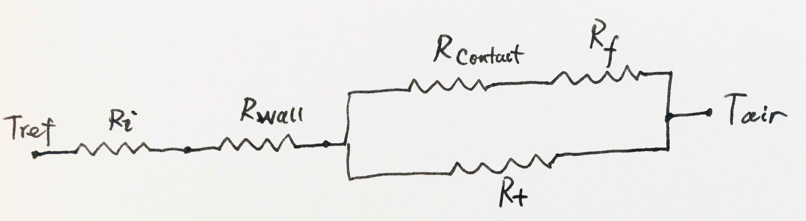

### 2.2 强制对流换热器
&emsp;&emsp;强制对流换热器通常指需要配合风机使用才能正常工作的换热器，以结构形式分类,常见的换热器及其用途有：

|结构类型|用途|安装位置|
|:--:|:--:|:--:|
|翅片式|蒸发器|箱体内部|
|旋翅式|冷凝器|压缩机仓|
|微通道管翅式|冷凝器|压缩机仓|
和常规自然对流换热器相比，强制对流换热器拥有更小的体积和更强的换热能力，所以强制对流换热器在大容积、高负荷产品上应用更广泛。例如，当冰箱容积在400L以上时，采用自然对流蒸发器来实现制冷需求就非常勉强了，而且综合成本也不再占优势；当冷柜容积在500L以上时，使用自然对流冷凝器就很难实现系统匹配要求了。
&emsp;&emsp;由于强制对流蒸发器可以实现自动除霜，也构成了所谓“无霜”或“风冷”冰箱的核心部件之一，在进行无霜冰箱的制冷系统设计时，蒸发器的设计既是重点也是难点，不仅要保证制冷系统的性能符合指标，还要保证系统稳定可靠地自动除霜，维持冰箱正常制冷。
>&emsp;&emsp;常见的翅片式蒸发器有斜插式和拉胀式两种
上表中的结构和应用场景并不是固定的，如翅片可以做蒸发器，也可以做冷凝器，旋翅式也可以做蒸发器，但需要强调的是，不同的用途和安装位置，对具体的换热器的设计的要求是不一样的。
>
#### 2.2.1 强制对流换热器的用途与性能要求
&emsp;&emsp;在冰箱系统中，强制对流换热器不是当冷凝器使用就是当蒸发器使用，这两种用途对换热器的设计有不同的要求：
&emsp;&emsp;作为蒸发器使用时，换热器的设计不仅要考虑到冰箱本身的制冷性能的要求，也要综合考虑冰箱的可靠性、噪音的要求：
+ 为了获得良好的换热性能，换热器需要在有限的安装空间内实现最强的换热能力；由于换热器性能和空气侧传热面积成正相关性，在无法明显提高传热系数的条件下，增加翅片和管路面积能够减小热阻，提高换热能力，但会造成空气侧阻力增加。
+ 由于冰箱的蒸发器的工作温度一般在-20度以下，随着系统运行，蒸发器上会有霜累计，霜层会增大蒸发器的热阻，还会造成通风截面积减小，通风量快速衰减，使系统输出到各间室的冷量大幅减小，所以从可靠性角度考虑，蒸发器需要较大的迎风面积，而这和减小蒸发器空间相矛盾；为了减小蒸发器的流动阻力，需要适当减少管路，增大翅片间距，这和增强换热能力的要求相矛盾。
+ 冰箱系统的压缩机噪音和风机噪音都和部件的运转频率有正相关性，所以当冰箱需要实现低噪音时，则需要强大的换热能力，保证在较低的压缩机、风机转速条件下冰箱的系统性能不会衰减。

可以看出，为了实现不同的需求，对蒸发器的设计的要求是互相矛盾的，在实际设计中要进行平衡。

&emsp;&emsp;冰箱的风冷冷凝器全部都安装在压缩机仓内，在压缩机仓内需要放置压缩机、冷凝风机、接水盘、冷凝器等部件和配管，所以压缩机仓的空间是非常有限的，冰箱风冷冷凝器的设计核心就是在有限的空间内实现最大的换热面积，而且要在较低冷凝风机转速条件下实现。

#### 2.2.2 冰箱用强制对流换热器的物理特性

##### 2.2.2.1 热阻构成
&emsp;&emsp;冰箱用的换热器是间壁式换热器，管内为制冷剂相变传热，在两相区传热系数很高，在$10^3Wm^{-2}K^{-1}$以上，在过热区传热系数略低，在$10^2Wm^{-2}K^{-1}$左右，但也比空气侧$10～30Wm^{-2}K^{-1}$的传热系数要高很多，所以换热器的设计必须要保证制冷剂侧两相换热段最大化。管壁热阻和管道与翅片的接触热阻都可以忽略：
其总热阻如下图所示：

$$R_{total}=R_1+\frac{1}{\frac{1}{R_2+R_4}+\frac{1}{R_3}}=\frac{1}{h_rA_r}+\frac{1}{h_aA_t+h_a\eta_fA_f}
$$
以一个最小的换热单元为例：

##### 2.2.2.2 流动阻力

换热器的关键设计指标:
1、管道水力直径: $D_h = \frac{4p}{A_c}$

2、翅片厚度: $\delta_f$

3、总管外换热面积:：$A_{tot} = A_t+A_f\centerdot\eta_f$

4、换热器体积：$ V_{hx} = L\centerdot H \centerdot D $

5、最小迎风面积: $ A_{min} =L_{min}\centerdot D_{min}$ 

6、换热面积密度：$ \beta_a= \frac{A_{tot}}{V_{hx}} $

4、无量纲数m: $ \eta_f = \sqrt{\frac{hp}{k_fA_c}}$

8、翅片效率：$\eta_f = \frac{tanh(mH)}{mH}$

4、热阻: $ R_{tot} = \frac {1}{h_rA_r}+\frac {1}{h_aA_{tot}}$

5、制冷剂侧传热系数: $h_r$

6、空气侧传热系数:$h_a$

7、制冷剂侧流动阻力

8、空气侧流动阻力
9、
### 2.2.1 换热器的应用要求

#### 2.2.1 斜插式蒸发器的性能
&emsp;&emsp;斜插式蒸发器的结构为U型盘管挤入开有多排一字斜孔的翅片中，盘管排列方式为叉排(stagger)，其翅片基本单元可分解为：

&emsp;&emsp;目前国内此类蒸发器的盘管排布间距只有22mm一种规格，管道排数和列数可以根据需要增加，由于这种设计能在狭小的空间里排列足够多的盘管，特别适合于小型风冷器具，而且具备结构简单和易加工的优点。

&emsp;&emsp;斜插式蒸发器的热阻可以按以下模型进行计算：

翅片间距为：  $ d_p $
管道外径为:   $ D_h $
翅片总面积：$A_f$
管道外侧总面积: $ A_{to}$
管道内侧总面积：$ A_{ti}$
翅片效率：$ \eta_f $
翅片厚度：$\delta_f$
 $$ A_{total}= A_t +A_f \space\space\space\space(1)$$
$$ R_{total}= \frac{1}{h_aA_{total}} +\frac{1}{h_{ref}A_{ti}}=\frac{1}{h_a(A_t +A_f \centerdot \eta_f)}+\frac{1}{h_{ref}A_{ti}} $$
总换热量：$$ Q = \frac {\Delta T}{R_{total}} $$
$$ \eta_f = \frac {tanh(mH)} {mH} $$
$$ m = \sqrt {\frac{2h}{k_f \delta_f}}$$
$$ H = \frac {D_h}{2}(\rho'-1)(1+0.35ln \rho')$$
对于顺排管束:
$$ \rho' = 1.28 \frac{B}{D_h}\sqrt{\frac{L}{B}-0.2} $$
对于叉排管束：
$$ \rho' = 1.27 \frac{B}{D_h}\sqrt{\frac{L}{B}-0.3} $$
#### 2.2.2 拉胀式蒸发器的性能 

#### 2.2.3 旋翅式冷凝器的性能

### 2.2.4 微通道冷凝器的性能计算

### 2.2.1 冰箱换热器的用途和要求

### 2.2.2 冰箱换热器的物理特性

### 2.2.3 冰箱换热器的数学模型

### 2.2.4 冰箱换热器的设计原则

### 2.3.5 换热器设计实例